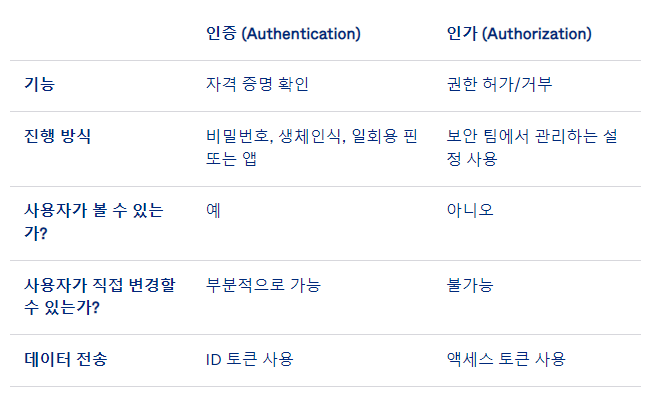

* [1. Data structure](#1-data-structure)
* [2. Java](#2-java)
* [3. Spring](#3-spring)
* [4. Server](#4-server)
* [5. Network](#5-network)
* [6. DB](#6-db)
* [7. 운영체제(OS)](#7------os-)
* [8. Architecture](#8-architecture)
* [9. VCS](#9-vcs)
* [10. Build](#10-build)
* [11. CI/CD](#11-ci-cd)
* [12. Testing](#12-testing)
* [13. Infra](#13-infra)
* [14. 방법론](#14----)
* [15. Monitoring & Analytics Tool](#15-monitoring---analytics-tool)
* [16. Security](#16-security)
* [17. Programming Language](#17-programming-language)
* [18. Term](#18-term)

## 1. Data structure

1. 배열(Array)
    - 데이터 타입이 같은 여러 개의 변수를 모아놓은 것
    - 개수에 상관없이 한번에 많은 데이터를 저장하고 사용할 수 있음
    - 고정된 크기에서 중간에 데이터 삽입 이루어지면 배열의 크기를 다시 조정하고 데이터를 옮기는 오버헤드가 발생함
2. 연결 리스트(List)
    - 크기를 미리 지정하지 않고 동적 할당이 가능함
    - 삽입, 삭제 연산에서 오버헤드가 적음
    - 특정 인덱스로 접근이 불가능하므로 데이터를 검색하려면 순차적으로 첫 노드부터 끝까지 순회해야 함
    - 중간에 데이터 삽입이 이루어져도 노드 간의 포인트만 수정하면 되기 때문에 배열에 비해 유리함
3. 스택(Stack)
    - 데이터를 임시로 저장하기 위한 자료 구조
    - 먼저 삽입한 데이터가 나중에 꺼내지고, 가장 나중에 삽입한 데이터가 가장 먼저 깨내지는 LIFO(Last In First Out) 구조
    - 데이터 삽입을 push, 데이터를 꺼내는 것을 pop이라고 함
    - 꺼낸 데이터는 스택에서 제거가 되고, top은 항상 스택의 마지막 위치를 가리키고 있어 데이터의 값을 확인할 수 있음
4. 큐(Queue)
    - 먼저 삽입된 데이터가 먼저 나가는 FIFO 구조
    - 큐의 마지막 위치에 데이터를 삽입할 수 있음
    - 큐는 앞에서만 데이터를 꺼낼 수 있음
5. 데크(Deque)
    - 스택과 큐의 혼합 자료구조
    - 양방향 삽입과 삭제를 지원하고 구현에 따라서 한쪽 방향에서만** 삽입 또는 삭제가 이루어지도록 구현할 수 있음
6. 트리(Tree)
    - 부모 자식 간의 관계를 가진 자료구조로, 나무 형태
    - 트리를 구성하는 요소로 노드와 간선(노드와 노드를 연결)으로 표현할 수 있음
    - 비선형 구조, 계층 구조
    - 각 노드는 하나의 부모 노드를 가지며, 자식 노드는 0개 이상 가짐
7. ArrayList
    - 가변 크기를 가짐
    - 크기에 관계 없이 저장 용량이 가득찬 상황에서도 요소들이 삽입될 수 있도록 크기를 재조정할 수 있음
8. LinkedList
    - 양방향으로 삽입 및 삭제가 이루어질 수 있는 이중 연결 리스트 구조
    - 삽입, 삭제 시에 ArrayList보다 빠른 성능을 가짐
    - 인덱스 기반이 아니기 때문에 검색 시에는 모든 노드를 순회해야 하기 때문에 ArrayList보다 성능이 낮음
9. Vector
    - ArrayList와 내부적으로 동일한 구조를 가지지만 동기화를 지원함
10. Map
    - 순서를 보장하지 않고, Key-Value의 한 쌍으로 이루어짐
    - Key는 중복을 허용하지 않고, Value는 중복을 허용함
11. Set
    - 중복과 순서를 보장하지 않는 자료 구조
12. Collection
    - List 인터페이스 : 순서 있고, 데이터 중복 허용, 색인으로 특정위치에 삽입 접근 가능
        - ArrayList 클래스 : 빠르고 순차적인 접근
        - vector 클래스 : 모든 메소드가 동기화
        - LinkedList 클래스 : 양방향 포인터 구조로 삽입/삭제 빠른 성능(스택, 큐)
    - Map 인터페이스:  Key-Value 쌍
        - HashMap 클래스 : 중복 불가, null 허용
        - HashTable 클래스 : HashMap 보다 느림, null 불가, 동기화 지원
        - TreeMap 클래스 : 이진검색트리 형태, 정렬 저장(검색 빠름)
        - LinkedHashMap 클래스 : 중복 불가, null 허용, 입력한 순서대로 iterator 가능
    - Set 인터페이스 : 중복 불가, 순서 없음
        - HashSet 클래스 : 중복 불가
        - TreeSet 클래스 : 이진검색트리 형태, 정렬 저장
    - 멀티 스레드 환경에서 안전하지 않기에 synchronized 를 통해서 thread-safe한 리스트를 만들어야 함

## 2. Java

1. 객체지향(OOP)
    1. 데이터를 추상화시켜 상태와 행위를 가진 객체를 만들고, 객체간 유기적 상호작용으로 로직 구성
        - 장점 : 코드 재사용, 코드의 변경이 용이, 직관적인 코드 분석, 개발속도 향상, 상속 가능
        - 단점 : 처리속도 느림, 설계시 어려움, 객체 많아지는 문제
    2. Object vs Class vs Instance(객체)
        - Object : 구현할 대상
        - Class : 구현하기위한 설계도
        - Instance : 구현된 실체
    3. 추상화
        - 공통 속성이나 기능 묶기
    4. 캡슐화
        - 속성과 기능을 class에 넣어 코드 재수정없이 재활용 가능한 것
    5. 상속
        - 일부 변경 시 부모 클래스 속성과 기능을 물려받는 것
    6. 다형성
        - 오버라이딩 : 부모클래스와 같은 이름의 메소드를 재정의 하는 것
        - 오버로딩 : 같은 이름의 함수를 여러개 정의하고, 매개변수 타입과 개수를 다르게 하는 것
    7. getter/ setter : 메서드 안에서 매개변수 입출력을 사전 처리
2. Interface, Abstract
    1. Interface
        - 일종의 추상 클래스
        - 오직 추상메서드와 상수만을 멤버로 갖음
        - implements 키워드를 사용
        - 상속의 관계가 없는 클래스간 서로 공동되는 로직을 구현하여 쓸 수 있도록 함
        - extends는 하나의 클래스만 상속 가능하나 interface는 다중 상속이 가능함
    2. Abstract
        - 추상메소드를 하나 이상 가진 클래스
        - 자신의 생성자로 객체 생성 불가능
        - 하위 클래스를 참조하여 상위 클래스의 객체를 생성
        - 하위 클래스를 제어하기 위해 사용
    3. 공통점
        - new 연산자로 인스턴스 생성 불가능
        - 프로토타입만 있는 메서드를 갖음
        - 사용하기 위해서는 하위클래스에서 확장/구현해야 함
    4. 차이점
        - 사용하는 키워드가 다름
        - abstract는 일반 메서드를 사용할 수 있지만, interface는 메서드 선언만 가능함
3. Call by Reference, Call by Value
    1. Call by Reference
        - 매개변수의 원래 주소에 값을 저장하는 방식, 클래스 객체를 인수로 전달한 경우
    2. Call by Value
        - 인수로 기본 데이터형을 사용
        - 주어진 값을 복사하여 처리하는 방식
        - 메서드 내의 처리 결과는 메서드 밖의 변수에 영향을 미치지 않음
4. GC
    - 시스템에서 더 이상 사용하지 않는 동적 할당된 메모리 블록을 찾아 자동으로 다시 사용 가능한 자원으로 회수 하는 것
    - 시스템에서 가비지 컬렉션을 수행하는 부분으로, 자바에서는 메모리 문제를 신경쓰지 않아도 됨
5. 자바의 메모리 영역
    1. 메소드
        - static 변수, 전역변수, 코드에서 사용되는 Class 정보 등이 올라감
        - 코드에서 사용되는 class들을 로더로 읽어 클래스별로 런타임 필드데이터, 메서드 데이터 등을 분류해 저장함
    2. 스택
        - 지역변수, 함수(메서드) 등이 할당되는 LIFO(Last In First Out) 방식의 메모리
    3. 힙
        - new 연산자를 통한 동적 할당된 객체들이 저장되며, Garbage 컬렉션에 의해 메모리가 관리되어짐
6. 디자인 패턴
    - 생성(Creational) / 구조(Structural) / 행위(Behavioral) 3가지로 분류
        1. 생성
            - 싱글톤과 팩토리 (클래스 정의 및 객체 인스턴스 생성 관여, 캡슐화)
                1. 싱글톤
                    - 객체 하나만 생성해 생성된 객체 어디서든 참조
                    - 단점
                        - private 생성자로 상속 못하기에 객체지향 위배
                        - Mock 테스트 불가
                        - 분산 서버에서 싱글톤이 하나만 객체를 생성함을 보장하지 못함
                        - 전역 상태를 만들기에 바람직하지 못함
                2. 팩토리
                    - 상위 클래스에서 객체 생성 인터페이스 정의, 하위 클래스에서 인스턴스 생성
        2. 구조
            - 어댑터와 프록시 (더 큰 구조 만들려 클래스, 객체 조합)
                1. 어댑터
                    - 기존 클래스 재사용 가능하게 인터페이스 사용
                2. 프록시
                    - 실 객체 접근 전 접근 제어하여 정보 은닉
        3. 행위
            - 옵저버와 템플릿 (클래스, 객체들 상호 작용 및 역할 분담)
                1. 옵저버
                    - 한 객체의 상태 변하면 의존 객체에도 상태 연동, 1:N 의존
                2. 템플릿
                    - 상위 클래스 내 작업 일부분을 서브 클래스로 캡슐화
7. Java의 장점과 단점
    1. 장점
        - 객체지향언어로 순차적으로 코드가 실행되는 것이 아니라 객체간의 상호작용으로 코드가 진행
        - 인터페이스를 사용하면 다중상속도 가능
        - 코드의 재사용성이 높아서 효율적, 코드의 가독성 좋, 유지보수도 쉬움
        - 가비지컬렉터가 자동으로 메모리 관리를 해서 개발자가 따로 동적메모리관리를 염두하지 않아도 됨
    2. 단점
        - 자료형이 고정적 -> JavaScript나 kotlin은 자료형이 동적으로 정해지기에 자료형에 대한 고민이 없어 비교적 불편
8. String, StringBuffer, StringBuilder 차이 및 장단점
    - String : 불변 (자주 문자열 수정, 추가, 삭제 시 Heap에 가비지 생성)
    - StringBuffer : 가변적, 동기화 지원하기에 멀티쓰레드에서 안전
    - StringBuilder : 가변적, 동기화 비지원하나 단일쓰레드에서 성능 좋음
9. java Primitive Type vs Reference type
    - Primitive Type : boolean, byte, short, int, long, float, double, char (실제값을 stack에 저장, Null을
      넣고 싶다면 래퍼 클래스 활용해야함)
    - Reference type : 배열, Enum, 클래스, 인터페이스 (주소값을 heap 메모리에 저장)
10. java 8 (java 15까지)
    - Stream API : 데이터를 추상화 처리
    - 람다식 : 함수를 하나의 식으로 표현한 것, 익명함수 (재사용, 디버깅 어려움)
    - 함수형 인터페이스 : supplier(반환값만), consumer(객체만 매개변수로), functon, predicate((객체 매개변수로 boolean 반환)
    - Optional로 nullable 처리
11. java 11
    - 가비지 컬렉터 개선
    - 람다 파라미터로 var
12. java 8 vs java 11
    
13. 가비지 컬렉션 알고리즘
    - VM 메모리는 클래스, 스택, 힙, 네이티브메소드 스택 영역으로 나뉘는데, GC는 힙 역역을 다룸
    - 모든 작동중 코드에서 더이상 참조하지 않는 Unreachalbe 객체를 찾아 반환하고 메모리 공간 최적화 함
    - JVM에서 메모리 누수 발생 원인
        - 객체를 사용하지 않지만 계속해서 참조를 하는 경우 메모리 누수가 발생 예) 리스트 내 객체를 삭제하지 않고 인덱스로 삭제한 것처럼 사용시 메모리 누수 발생
        - System.gc()
            - 개발자가 의도적으로 GC 실행 가능하지만 실제 동작 안할수도 있다.
            - stop-the-world(GC을 실행하기 위해 JVM이 애플리케이션 멈춤)로 시스템 성능저하 올수도 있음
14. 함수형 프로그래밍
    - 객체 상태를 변화 시키지 않음
    - 동일 인자시 항상 같은 값을 리턴
    - 기능 분할 및 추상화 가능 -> 코드 동작 추론 가능하며, 멀티스레드에서 객체를 안전하게 공유 가능, 재사용 가능, 테스트 쉬움
15. equals() vs hashCode()
    1. equals()
        - 두 객체가 동일한지 검사하는 메소드
        - 두 객체가 참조하는 것이 동일한지
        - 두 객체가 가리키는 곳이 동일한 메모리 주소인지 확인
        - 두 객체의 내용이 같은지 확인
    2. hashCode()
        - 실행 중에 객체의 유일한 integer 값을 반환함
        - 메모리에 가진 해시 주소값을 기본적으로 반환
        - 두 객체가 같은 객체인지 확인

    - equals()를 오버라이드 한다면 hashCode()도 오버라이드 되어야 함
    - Java 프로그램을 실행하는 동안 equals에 사용된 정보가 수정되지 않았다면, hashCode는 항상 동일한 정수값을 반환해야함
      (Java의 프로그램을 실행할 때마다 달라지는 것은 상관이 없음)
    - 두 객체가 equals()에 의해 동일하다면, 두 객체의 hashCode() 값도 일치해야 함
    - 두 객체가 equals()에 의해 동일하지 않다면, 두 객체의 hashCode() 값은 일치하지 않아도 됨
16. == vs equals()
    1. ==
        - 객체의 주소값을 비교
        - 피연산자가 primitive type(int, double, booelan..)일 때는 값이 같은지 비교
        - 피연산자가 그 외 객체, reference type일 때는 주소가 같은지 비교
    2. equals()
        - 객체 내부의 값을 비교
        - primitive type은 내용이 같은지 검사
        - reference type은 주소가 같은지 검사
17. 직렬화와 역직렬화
    1. 직렬화
        - 객체를 직렬화하여 전송 가능한 형태로 만드는 것
        - 객체의 데이터를 연속적인 데이터로 변형하여 Stream을 통해 데이터를 읽도록 해줌
        - 객체들을 통째로 파일로 저장, 전송하고 싶을 때 사용됨
    2. 역직렬화
        - 직렬화된 파일 등을 역으로 직렬화하여 다시 객체의 형태로 만드는 의미
        - 저장된 파일을 읽거나 전송된 스트림 데이터를 읽어 원래 객체의 형태로 복원함
18. Boxing과 UnBoxing
    1. Boxing
        - Primitive -> Wrapper
    2. UnBoxing
        - Wrapper -> Primitive

    - 기존의 자바에 Collection 자료구조 인터페이스들이 하나둘씩 추가됨에 따라 기본타입을 활용해서 Collection에 담을 수 없게 되어 그로 인해 primitive
      타입을 내부로 감싼 Wrapper 타입을 활용하게 되고 좀더 유연한 Collection 사용이 가능해지도록 하였음

## 3. Spring

1. Spring
    - 복잡한 EJB와 고가의 WAS 없이 톰캣, 제티에서도 돌아가는 자바 엔터프라이즈 경량급 프레임워크
2. Spring Container 라이프사이클
    - 빈 객체 생성 > 빈 프로퍼티 설정 > 빈 사용 > 빈 소멸
3. Bean 라이프 사이클
    - 객체 생성 > 초기화 > 사용 > 소멸
4. Spring Bean 객체 범위
    - 주요 범위는 싱글톤(호출시 동일 객체), 프로토타입(호출시 새로운 객체, 스프링 컨테이너 소멸되도 객체는 유지)
5. IoC(Inversion of Control)제어의 역전
    - 스프링이 제어권을 갖고 빈팩토리 컨테이너를 통해 빈 등록, 생성, 조회, 관리하는 것 -> 프로그램의 생명주기에 대한 제어권이 어플리케이션 컨테이너에 있음
    - 사용자가 직접 new 연산자를 통해 인스턴스를 생성하고 메소드를 호출하는 일련의 생명주기에 대한 작업들이 스프링에 위임할 수 있게 됨
    - ApplicationContext : 빈팩토리 확장한 IoC 컨테이너, 싱글톤을 저장하고 관리
    - 스프링은 평범한 자바 클레스도 빈팩토리 컨테이너에 빈 제어권을 넘기면 모두 싱글톤(여러번 빈 호출해도 동일 오브젝트 반환)으로 관리
    - 싱글톤은 멀티스레드 환경에서 동시 접근 사용 가능하기에 stateless 방식으로 만들어야 함
6. DI (Dependency Injection)
    - 컨테이너나 빈팩토리가 런타임시에 의존관계 주입, 이는 ApplicationContext에 명시
    - 객체 사이에 필요한 의존 관계에 대해서 스프링 컨테이너가 자동으로 연결해주는 것을 말함
    - 스프링 컨테이너는 DI를 이용해 빈(Bean) 객체를 관리하고, 스프링 컨테이너에 클래스를 등록하면 스프링이 클래스의 인스턴스를 관리해줌
        - 소스 수정없이 설정만으로 프로그램 제어 가능
    - 설정 방법
        - XML 설정
        - 어노테이션 설정
            1. @Component를 사용하여 해당 클래스를 찾아 @Autowired가 붙은 클래스를 자동으로 객체로 만들어주고 사용할 수 있게 해줌
            2. XML 설정에 auto scan 범위를 설정하면 해당 패키지 범위에 Component를 설정하여 사용할 수 있음
            3. @Component의 확장된 어노테이션을 사용하면 스프링은 패키지 및 하위 패키지 내에서 해당 어노테이션을 찾아서 인젝션함
                1. @Repository
                    - 데이터베이스에서 정보를 검색하는 DAO에 사용됨
                2. @Service
                    - 서비스 계층 클래스에서 사용되고, 데이터 및 비즈니스 로직 처리에 사용됨
                3. @Controller
                    - UI에서 요청 처리에 사용됨
7. AOP (Aspect Oriented Programming)
    - 주요 핵심 기능과 핵심 기능 구현을 위한 부가적인 기능 구현을 분리하여 각각의 관점별로 묶어서 개발하는 방식
    - 하나의 공통된 로직에서 처리할 수 있도록 모듈화하여 개발하는 것을 말함
    - 관점 지향 프로그래밍, 로직을 기준으로 core, sub로 나누고 각각 모듈화
        - core : 핵심 비즈니스
        - sub : DB연결, 로깅, 부가 서비스
    - 스프링 AOP는 IoC와 연동해 중복 코드, 프록시 클래스 작성 번거로움, 객체 관계 복잡도를 해소함
    - 용어
        1. Aspect
            - 흩어져 있는 관심사인 부가기능들이 모듈화한 것
        2. Target
            - 모듈화된 부가 기능(Aspect)을 수행해야 하는 주요 비즈니스 클래스 또는 메소드 등을 의미
        3. JoinPoint
            - 구현된 부가 기능(Advice)을 실제 수행할 지점
        4. PointCut
            - 부가 기능을 수행할 지점(Advice)에 대한 스펙 정의서
        5. Advisor
            - PointCut + Advice : 스프링 AOP에서 사용하는 특별한 용어
8. Spring MVC : Dispatcher Servlet
    - Tomcat과 같은 서블릿 컨테이너에서 들어오는 HTTP 요청을 프론트 컨트롤러로 공통 처리작업을 이후 적절한 세부 컨트롤러로 작업 위임함
    - 장점
        - web.xml(URL 매핑)의 역할 축소
    - 클라이언트 요청 > dispatcher servlet에서 handler mapping에 요청 매핑한 컨트롤러 있는지 검색 > 컨트롤러에 처리 요청 > 컨트롤러에서
      클라이언트 요청 처리하고 출력할 view 이름 dispatcher servlet로 리턴 > view resolver에서 view 검색 > 처리된 vie 리턴 > 최종결과
      출력
    - <mvc:resources/>
        - Dispetcher servlet에서 요청에 따른 컨트롤러 못찾을떄 경로에서 자원 탐색
9. Spring Boot
    - Spring Framework의 많은 부분을 자동화함
    - starter 디펜던시만 추가하면 바로 API를 정의 가능
    - 내장된 tomcat이나 jetty로 웹 어플리케이션 서버를 실행할 수 있음
    - Spring 홈페이지의 initailize를 통해 바로 실행 가능한 코드를 만들어줌
    - 실행환경이나 의존성 관리 등의 인프라 관련 등은 신경쓸 필요가 없음
10. Spring vs Spring MVC vs Spring Boot
    - embeded tomcat 제공
        - Spring Framework에서는 매번 tomcat을 설치하거나 버전 관리를 해야함
        - Spring Boot에서는 내장 톰캣을 사용하기 때문에 이러한 수고로움을 덜어줌
        - 독립적으로 실행 가능한 jar로 손쉽게 배포가 가능해짐
    - starter를 통한 dependency의 자동화
        - Spring Framework에서는 각 dependency들의 호환되는 버전이 일일히 맞추어 주여야 하고, 하나의 버전을 올리고자 하면 다른 dependecy까지
          영향을 미쳐 버전 관리의 어려움이 있었음
        - Spring Boot에서는 starter가 대부분의 dependency를 관리해주기 때문에 이러한 수고로움을 덜어줌
    - AutoConfigurator
        - 공통적으로 필요한 DispatcherServlet 같은 설정을 어노테이션을 이용하여 대신할 수 있음
        - Spring Boot의 main 메소드의 @SpringBootApplication을 제공
            - ComponentScan + configuration + EnableAutoConfiguration이 합쳐진 어노테이션
    - Spring Actuator를 통해 어플리케이션의 모니터링과 관리 가능
      
11. Spring Boot Starter
    - 특정 목적을 달성하기 위한 의존성 그룹
    - 간편하게 dependency를 제공해주는데, maven이나 gradle에 starter만 추가해주면 Spring Boot가 그에 필요한 라이브러리들을 알아서 받아
      Spring Boot Starter 웹 프로젝트가 pre-packaged된 형태로 제공되어 개발자가 dependency 관리나 호환버전에 대하여 고려할 필요가 없음
    - 명명 규칙
        - spring-boot-starter-*
12. Spring Boot 4계층
    - Presentation Layer
        - view(front-end)로 구성
    - Data Access Layer
        - 데이터베이스에 대한 CRUD(create, retrieve, update, delete)
    - Service Layer
        - 서비스 클래스로 구성되고, 데이터 접근 계층에서 제공하는 서비스를 사용
    - Integration Layer
        - 웹별 웹 서비스
13. Spring Cloud Config
    - 마이크로서비스의 어떠한 설정(환경변수값, Spring cloud 설정 등)이 변경되었을때 서버 재시작 없이 동적으로 적용하기 위함
    - 마이크로서비스가 배포될때 제반 설정값들을 배포 대상 환경(개발계, 검증계, 운영계 등)에 맞게 적용하기 위함
    - 마이크로서비스를 Stateless하게 개발하기 위함
        - Stateless하게 만들어야 스케일링(마이크로서비스 인스턴스 서버 - 즉, 컨테이너의 증감)과 부담없는 재시작이 가능함
    - 분산 시스템에서 스프링 프로젝트의 설정파일을 외부로 분리시켜 중앙집중관리 가능
        - 다른 git repo에 application.yml 두고 관리
    - 설정이 변경되었을 때 애플리케이션의 재배포 없이 적용가능
        - @RefreshScope : 앱 재배포 없이 실시간 반영 방법 (재기동 되는 방법)
    - bootstrap.yml : 스프링부트 앱 기동시 application.yml 보다 먼저 로드
14. Spring Cloud Eureka
    - 각 마이크로서비스의 IP/FQDN과 PORT정보를 저장하고 제공하는 Service Discovery
    - Microservice와 Eureka server간 통신
        - 각 마이크로서비스는 구동 시 Service Discovery(Eureka Server)에 자신의 IP/FQDN과 PORT를 등록함
        - Eureka Server는 주기적으로 각 마이크로서비스의 실행여부를 체크하는데, 정지된 경우, registry에서 삭제함
        - 각 마이크로서비스는 등록된 모든 마이크로서비스의 정보를 주기적으로 갖고 와서 캐싱할 수 있음
        - 한 마이크로서비스가 다른 마이크로서비스를 연결할때는 캐싱된 registry정보를 이용하거나 Eureka server를 조회하여 대상 마이크로서비스의
          IP/FQDN과 PORT를 구해 연결함
15. Spring Cloud Zuul
    - API Gateway
    - zuul은 Java로 개발된 서버이고 커스터마이징할 수 있는 어플리케이션
    - class로 개발된 filter가 이용되며, overriding하여 필요한 수행을 추가할 수 있음
    - 보통 들어오는 요청에 대해 'pre' filter에서 인증/인가 처리를 하고, routing filter에서 L/B, Routing, Circuit break를
      처리하며, Post filter에서 요청과 응답에 대한 Logging을 처리
    - L/B는 ribbon이라는 라이브러리가 사용되고, Routing은 zuul core라이브러리가 사용되며, Circuit break는 Hystrix라이브러리가 사용됨
    - 서블릿 프레임워크 기반으로 동기(Synchronous), 블로킹(Blocking) 방식으로 서비스를 처리
    - Zuul2는 비동기, 논블로킹 가능 -> Spring에서 사용하기 어려움 -> Spring Cloud Gateway 사용
      
16. Spring Cloud Gateway
    - MSA 환경에서 사용하는 API Gateway
        - Kuberentes Ingress 와 비슷?
            - kubernetes 내 컨테이너 서비스들을 URI별로 다르게 호출시 사용하나, 서비스 인증/보안 JWT 기능을 Ingress에서 구현 불가
    - API Gateway가 필요한 이유는 안전한 API유통과 Client 요청별로 유연하게 대처하기 위함이며, API Gateway는 인증/인가, L/B & 라우팅, 로깅,
      Circuit Breaker의 역할을 함
      
    - Spring5, SpringBoot2, Project Reactor
    - API 라우팅 및 보안, 모니터링/메트릭
    - 모든 트래픽이 Spring Cloud Gateway를 통하기에 인증/보안에 좋고 모니터링이 가능함
    - URI에 따라 서비스 엔드포인트를 다르게 할수 있음(동적 라우팅, 도메인변경 불필요)
    - 동적라우팅으로 신규 스펙 일부 적용/ 트래픽 점진적 증대 가능
    - Netty 런타임 기반으로 동작 (서블릿 컨테이너나 WAR로 빌드된 경우 동작하지 않음)
17. Spring Cloud Ribbon
    - Ribbon은 Load balancing을 요청 어플리케이션 단에서 수행해주는 Client-side Load balancer
    - Ribbon을 사용하면 API Gateway없이 대상 어플리케이션을 직접 로드밸런싱하여 연결할 수 있음
18. Spring Cloud LoadBalancer
    - Spring Cloud Ribbon과 동일한 Client-side Load Balancer
    - Client side Load balancer가 필요한 이유는 부하분산을 적절하게 하여 서비스의 가용성을 최대화하기 위함
19. Netflix Ribbon vs Spling Cloud LoadBalancer
    1. HttpClinet 지원
        - Ribbon은 Blocking방식의 HttpClient인 RestTemplate만 지원
        - SCL은 RestTemplate뿐 아니라, Non-blocking방식을 지원하는 Spring WebClient도 지원
    2. Load Balancing 정책
        - Ribbon은 RoundRobin, AvailabilityFilteringRule, WeightedResponseTimeRule의 3가지 정책을 지원
        - SCL은 RoundRobin과 Random정책만 지원
20. Spring Cloud Histrix
    - Hystrix는 마이크로서비스의 전류차단기(Circuit Breaker) 역할을 하는 오픈소스
    - 누전차단기가 전기사고가 발생하기 전에 전기를 미리 차단하는것과 동일하게, 문제가 있는 마이크로서비스로의 트래픽을 차단하여 전체서비스가 느려지거나 중단되는것을 미리
      방지하기 위해 필요함
21. Spring Cloud Sleuth
    - Sleuth는 분산된 마이크로서비스간에 트래픽의 흐름을 추적(Tracing)할 수 있도록 Trace기록을 로그에 자동 삽입
    - Sleuth와 Zipkin이 필요한 이유는 분산된 마이크로서비스간의 트래픽을 추적하여 문제를 사전에 방지하거나 해결하기 위함
    - 마이크로 서비스 환경에서 클라이언트의 호출 추적하는 zipkin client library
    - 호출되는 서비스에 Trace-ID(클라이언트 호출 시작부터 끝까지 동일한 ID), Span-ID(마이크로서비스당 1개 ID) 부여
22. Zipkin
    - Zipkin은 분산 트랜잭션 추적을 위한 오픈소스소프트웨어
    - 마이크로 서비스 환경에서 로그 트레이싱하는 오픈소스
    - zipkin client library와 zipkin server(Collector, Storage, API, Web UI)로 구성
    - zipkin client library : 트레이싱 정보 수집해 Collector 모듈 호출 (HTTP, Kafka 큐 사용)
    - zipkinserver
        - Collector : 트레이싱 정보 수집, 유효성 검증, 검색 가능하게 색인화
        - Storage : 트레이싱 정보 저장 (In-Memory, MySQL, Cassandra, ElasticSearch)
        - API : 트레이싱 정보 검색 JSON API
        - Web UI : GUI로 만든 대시보드, 서비스 / 시간 / 어노테이션 기반으로 데이터 확인
23. Spring Cloud Circuit Breaker & Resilience4J
    1. Spring Cloud Circuit Breaker
        - Netflix Hystrix, Resilience4J, Alibaba Sential, Spring Retry와 같은 Circuit Breaker제품들을 사용하기
          위해 표준 인터페이스를 제공하는 추상화(또는 Facade) 라이브러리
    2. Resilience4J
        - Java 전용으로 개발된 경량화된 Fault Tolerance(장애감내) 제품
        - 핵심 모듈
            1. Circuit Breaker
                - Count(요청건수 기준) 또는 Time(집계시간 기준)으로 Circuit Breaker제공
            2. Bulkhead
                - 각 요청을 격리함으로써, 장애가 다른 서비스에 영향을 미치지 않게 함(bulkhead-격벽이라는 뜻)
            3. RateLimiter
                - 요청의 양을 조절하여 안정적인 서비스를 제공. 즉, 유량제어 기능임.
            4. Retry
                - 요청이 실패하였을 때, 재시도하는 기능 제공
            5. TimeLimiter
                - 응답시간이 지정된 시간을 초과하면 Timeout을 발생시켜줌
            6. Cache
                - 응답 결과를 캐싱하는 기능 제공
24. Spring WebClient
    - 웹으로 API를 호출하기 위해 사용되는 Http Client 모듈 중 하나
    - 요청자와 제공자 사이의 통신을 좀 더 효율적인 Non-Blocking방식으로 하기 위해서 필요함

    1. Resttemplate과 WebClient
        1. 공통점
            - HttpClient모듈
        2. 차이점
            - 통신방법이 RestTemplate은 Blocking방식이고, WebClient는 Non-Blocking방식
25. 예외 처리
    - checked exception (IO exception), uncheked exception (null pointer exception)
    - error response 통일화, message, code, status Root & Enum 관리, @ControllerAdvice 어노테이션을 통해 모든 예외를
      핸들링, RuntimeException을 상속받는 커스텀 클래스를 생성 및 사용
26. DAO, DTO, VO, Entity의 차이
    1. DAO(Data AccessObject)
        - DB를 사용해 데이터를 조회/조작하는 기능을 전담하기 위해 만들어진 오브젝트
        - DB 데이터에 접근하기 위한 객체, 직접 DB에 접근하여 데이터를 삽입, 삭제, 조회 등 조작할 수 있는 기능을 수행함
        - DB 접속을 하기 위한 로직과 비즈니스 로직을 분리하기 위해 사용됨
        - DB와 연결할 Connection까지 설정되어 있는 경우가 많음
            - Mybatis에서는 connection pool까지 제공하고 있어 DAO를 별도로 만드는 경우는 드뭄
    2. DTO(Data Transfer Object)
        - 계층(Controller, View, Business Layer) 간의 데이터 교환을 위한 Java Beans를 의미함
        - 데이터의 전송과 계층의 분리를 함
        - 로직을 가지지 않는 데이터 객체로, getter/setter 메소드만 가진 클래스를 의미함
        - 데이터 전송(이동)이라는 객체를 가지고 있는데, 주로 비동기 처리 시에 사용함
    3. VO(Value Object)
        - Read-only 속성을 갖는 오브젝트
        - 특정한 비즈니스 값을 갖는 객체, 담긴 데이터 그 자체에 의미를 둠
        - 단순히 값의 타입을 표현하기 위한 불변 클래스를 만들어 사용함
        - equals()와 hashCode()를 오버라이딩함
        - VO 내부에 선언된 속성(필드)의 모든 값들이 VO 객체마다 값이 같아야 똑같은 객체라고 판별함
        - getter, setter를 가질 수 있고, 테이블 내에 있는 속성 외에 추가적인 속성을 가질 수 있음
    4. Entity
        - 영속화될 수 있고 식별 가능한 객체로, 실제 DB 테이블과 1:1로 매핑되는 클래스
        - DB의 테이블 내에 존재하는 컬럼만을 속성(필드)로 가져야 함
        - 상속을 받거나 구현체여서는 안되고, 테이블 내에 존재하지 않는 컬럼을 가져서도 안됨
27. ORM
    - 객체 관계 매핑, 객체와 RDB를 별개로 설계하고 ORM이 중간에서 매핑해주는 역할
    - SQL 문이 RDB에 데이터 그 자체와 매핑하기 때문에 SQL을 직접 작성할 필요가 없음
28. Mybatis
    - 개발자가 지정한 SQL, 저장프로시저 그리고 몇가지 고급 매핑을 지원하는 퍼시스턴스 프레임워크
    - JDBC로 처리하는 상당부분의 코드와 파라미터 설정및 결과 매핑을 대신해줌
    - 데이터베이스 레코드에 원시타입과 Map 인터페이스 그리고 자바 POJO 를 설정해서 매핑하기 위해 XML과 애노테이션을 사용할 수 있음
    - SQL Mapper를 지원해주는 Framework
    - SQL 작성을 직접 하여 객체와 매핑시켜줌
29. SQL Mapper
    - SQL문을 이용하여 RDB에 접근, 데이터를 오브젝트(객체)화 시켜줌
    - 개발자가 작성한 SQL문으로 해당되는 ROW를 읽어 온 후 결과 값을 오브젝트화 시켜 사용가능하게 만들어줌
    - DB에 따라 SQL 문법이 다르기 때문에 특정 RDB에 종속적
30. JPA vs Mybatis
    1. JPA
        1. 장점
            - RDB에 종류와 관계없이 사용 가능함 추후 DB 변경이나 코드 재활용에 용이함
            - 기본적인 CRUD 제공과 페이징 처리 등 상당 부분 구현되어 있어 비지니스 로직에 집중할 수 있음
            - 테이블 생성, 변경 등 엔티티 관리가 간편함
            - 쿼리에 집중할 필요 없어 빠른 개발이 가능함
                - SQL을 몰라도 된다는 뜻이 아니며, JPA는 SQL을 잘할수록 훨씬 더 잘 사용할 수 있음
                - 쿼리를 직접 작성할 필요 없이 Java 코드로 간편하게 사용할 수 있음
        2. 단점
            - 어려움
                - 단방향, 양방향, 임베디드 관계 등 이해해야할 내용이 많으며, 연관관계 이해 없이 잘못 코딩 했을 시 성능상의 문제와 동작이 원하는대로 되지 않는
                  일이 발생함
    2. Mybatis
        1. 장점
            - JPA에 비해 쉬움
                - SQL 쿼리를 그대로 사용하기에 복잡한 Join, 튜닝 등을 좀더 수월하게 작성 가능
            - SQL의 세부적인 내용 변경 시 좀 더 간편함
            - 동적 쿼리 사용 시 JPA보다 간편하게 구현이 가능함
        2. 단점
            - 데이터 베이스 설정 변경 시 수정할 부분이 너무 많음
                - 예) Oracle의 페이징 쿼리를 MySQL에서 사용 불가능
            - Mapper작성부터 인터페이스 설계까지 JPA보다 많은 설계와 파일, 로직이 필요함
            - 특정 DB에 종속적임

## 4. Server

1. Web 서버와 WAS
    - 자원이동 효율성, 장애극복, 배포, 유지보수 편의성

    1. Web 서버
        - 소프트웨어와 하드웨어로 구분됨
            - 소프트웨어
                - 웹 브라우저 클라이언트로부터 HTTP 요청을 받아 정적인 컨텐츠(css, html)를 제공하는 컴퓨터 프로그램
            - 하드웨어
                - Web 서버가 설치되어 있는 컴퓨터
        - 기능
            1. HTTP 프로토콜을 기반으로 하여 클라이언트(웹 브라우저 또는 웹 크롤러)의 요청을 서비스하는 기능을 담당
                - 정적인 컨텐츠를 제공, WAS를 거치지 않고 바로 자원을 제공함
            2. 동적인 컨텐츠 제공을 위한 요청을 전달
                - 클라이언트의 요청을 WAS에 보내고, WAS가 처리한 결과를 클라이언트에게 전달함
    2. WAS
        - DB 조회나 다양한 로직 처리를 요구하는 동적인 컨텐츠를 제공하기 위해 만들어진 Application Server
        - HTTP를 통해 컴퓨터나 장치에 애플리케이션을 수행해주는 미들웨어
        - 웹서버 + 웹컨테이너로 JSP, Servlet 구동환경 제공
        - 분산 트랜잭션, 보안, 메시징, 쓰레드 처리 등의 기능을 처리
        - 기능
            1. 프로그램 실행 환경과 DB 접속 기능 제공
            2. 여러 개의 트랜잭션 관리 기능
            3. 업무를 처리하는 비즈니스 로직 수행
        - 동작 방식
            1. Web Server 의 클라이언트의 요청에 맞는 Servlet을 메모리에 올린다.
            2. web.xml 참조해 해당 Servlet에 대한 Thread를 생성한다.
            3. HttpServletRequest와 HttpServletResponse 객체를 생성하고 그에 맞는 doGet 또는 doPost 메소드를 호출해 생성된
               동적 페이지를 Response 객체에 담아 WAS에 전달한다.
            4. WAS는 HttpResponse 형태로 바꾸어 WebServer에 전달한다.
            5. WAS는 생성된 쓰레드와 HttpServletRequest, HttpServletResponse 객체를 제거한다.

3. 프록시(Proxy)
    - 요청에 대한 응답을 캐싱해두어 다음에 같은 요청이 전달됐을 때 캐싱해둔 응답을 반환할 수 있음
    - 대역이나 서버 리소스를 소비하지 않고, 빠르게 요청을 처리할 수 있음
    - 포워드 프록시(Forward Proxy) vs 리버스 프록시(Reverse Proxy)
        1. 포워드 프록시(Forward Proxy)
            - 클라이언트가 외부 서버에 액세스할 때 사이에 두는 프록시
        2. 리버스 프록시(Reverse Proxy)
            - 외부의 클라이언트가 내부 서버에 접근할 때 사이에 두는 프록시
            - 캐시 서버를 효과적으로 이용함으로써 리소스 소비를 억제하고 대량의 요청을 처리할 수 있게 됨
            - 갱신 빈도가 낮은 동적 페이지가 많을 경우에 유용함
4. Nginx
    - 경량 웹 서버
    - 클라이언트로부터 요청을 받을 때 요청에 맞는 정적 파일을 응답해주는 HTTP Web서버로 활용되기도 하고, 리버스 프록시(Reverse Proxy) 서버로도 활용되며,
      WAS 서버의 부하를 줄일 수 있는 로드밸런서로 활용되기도 함
    - Apache 서버와 다른 점
        1. Apache
            - 클라이언트로부터 받은 요청을 처리할 때 새로운 프로세스 혹은 쓰레드를 생성하여 처리하는데, 요청마다 쓰레드가 생성되므로 사용자가 많으면 그만큼 쓰레드가
              생성되어 CPU와 메모리 자원의 소모가 큼
        2. Nginx
            - Event-Driven 구조로 동작하여 한 개 혹은 고정된 프로세스만 생성하여 사용하고, 비동기 방식으로 요청들을 병렬처리할 수 있음
            - 새로운 요청이 들어오더라도 새로운 프로세스와 쓰레드를 생성하지 않기 때문에 프로세스와 쓰레드 생성 비용이 존재하지 않고, 적은 자원으로도 효율적인 운용이
              가능함
            - 단일 서버에서도 동시에 많은 연결을 처리할 수 있음

## 5. Network

1. 라우팅
    - 특정 네트워크 내부에서 목적지를 찾아가는 과정을 의미함
2. TCP/IP
    - 레이어 3의 IP와 레이어 4의 TCP/UDP를 합쳐 통신을 하는 프로토콜
3. TCP와 UDP
    - 전송 계층에서 사용하는 프로토콜

    1. TCP(Transmission Control Protocol)
        - 연결형, 데이터 신뢰성(패킷 추적 및 관리), 흐름 제어 가능, 전송 순서 보장, UDP보다 빠름
        - 수신지에 데이터가 정확하게 전달되도록 전송 속도를 조절하거나 도달하지 않은 데이터를 재전송함
        - 속도보다는 정확한 전달을 중시함
        - 신뢰성이 요구되는 어플리케이션에서 사용
        - 3-way handshaking을 통해 연결 설정, 4-way handshaking을 통해 연결 해제
    2. UDP(User Datagram Protocol)
        - 비연결형, 핸드쉐이크과정 없음, 신뢰성 없음, TCP보다 빠름
        - 정확성보다 속도를 중시함
        - 간단한 데이터를 빠른 속도로 전송하고자 할 경우 사용
        - 인터넷상에서 서로 정보를 주고받을 때 정보를 보낸다는 신호나 받는다는 신호 절차를 거치지 않고, 보내는 쪽에서 일방적으로 데이터를 전달하는 통신 프로토콜
        - 보내는 쪽에서는 받는 쪽이 데이터를 받았는지 받지 않았는지 확인할 수 없고, 또 확인할 필요도 없도록 만들어진 프로토콜
4. TCP와 UDP의 공통점과 차이점
    1. 공통점
        - 포트번호를 이용하여 주소를 지정
    2. 차이점
       
       
5. OSI 계층
    - 물데네전세표응 (물리, 데이터링크, 네트워크, 전송, 세션, 표현, 응용)
    - 물리 : 데이터 전달, 전기적신호, 케이블 통신
    - 데이터링크 : point to point 신뢰성 있는 데이터 전송, 주소값 할당, 브릿지/스위치
    - 네트워크 : 노드 경로 찾아줌, IP(주소 부여), Router (경로 설정)
    - 전송 : end to end 데이터 교환 신뢰성, 패킷 실제전송 (TCP, UDP)
    - 세션 : 세션 만들고 없애는 책임, 연결 세션에서 데이터 교환 및 에러 복구 관리
    - 표현 : 데이터 번역 (아스키코드, jpeg)
    - 응용 : 응용 서비스
6. HTTP, HTTPS
    1. HTTP
        - TCP 80포트 사용해 테스트를 주고받기에 보안 취약
    2. HTTPS
        - SSL/TLS로 세션 데이터 암호화, TCP/IP 443 포트이고 SSL 프로토콜 위에서 HTTPS 프로토콜 작동, 무결성 보장, 정보유출 방지,권한 허락
7. HTTP vs WebSocket vs MQTT
    - HTTP
        - client 요청시에만 서버가 응답하는 단방향 통신
    - WebSocket
        - TCP 기반 양방향 통신 프로토콜, 대부분 브라우저에서 지원, server-client 구조로 안정적 connection 관리, 실시간 통신
    - MQTT
        - 메시징 패킷 프로토콜, 구독-발행 구조이며 작은 패킷으로 오버헤드가 적기에 저전력 환경 동작 (인증, ManyToMany, QoS, 성능에서 안좋음)

## 6. DB

1. RDBMS vs NoSQL
    1. RDBMS
        - 데이터 관계를 FK 등으로 정의하고 이를 이용하여 Join 등의 관계형 연산을 함
        - 데이터 스키마 변경 불가, 대부분의 데이터베이스에서 안정적으로 사용 가능
    2. NoSQL
        - 스키마와 관계가 없어 다른 구조의 데이터를 컬렉션에 추가할 수 있음
        - 테이블 스키마가 유동적임
    3. 장점/단점
        1. RDBMS
            1. 장점
                - 트랜잭션 처리가 가능, 데이터의 정합성이 높은 정규화를 통해 중복 데이터 삭제 가능
            2. 단점
                - 대량의 데이터 입력이 어렵고, 테이블의 인덱스 생성이나 스키마 변경이 어려움, 수평확장이 어렵고 수직적 확장만 가능함, Join 문이 매우 복잡한
                  쿼리가 만들어질 수 있음
        2. NoSQL
            1. 장점
                - 스키마가 따로 없음, JSON
                - 문서 기반으로 저장하며 필드를 인덱싱해 검색이 빠름, 확장성이 좋음
            2. 단점
                - 데이터 중복으로 인한 수정 작업의 번거로움
                - Join 연산 불가능
                - 유연성 때문에 구조 결정이 늦어질 수 있음
                - 복사된 데이터가 변경되면 여러 콜렉션과 문서를 수정해야 함
2. Oracle
3. Redis
    - Remote에 프로세스로 존재하는 In-Memory 기반의 키-값 구조 데이터 관리 시스템
    - String(key-value), Set(중복X), Sorted Set, Hash, List 다양한 자료구조(Collection) 지원 (Memcached와 차이점)
    - 캐시/ DISK 기반으로 저장 가능
        - 캐시 : 용량 적지만 접근 속도는 빠름
            - Look aside cache : 클라이언트 요청 데이터가 있는지 캐시 확인후 없으면 DB에서 읽어 캐시 저장후 돌려줌
            - Write Back : 데이터를 캐시에 전부 저장후 특정 시점마다 DB에 저장
    - Redis는 한 트랜잭션당 하나의 명령만 수행 가능해 race condition 안생김 (공유자원 문제)
    - Single thread로 이슈 덜하나 더블클릭으로 여러번 데이터 들어갈 수 있음
    - 인증 토큰 저장/ 유저 API limit이 있는 상황에서 주로 사용
    - 특징
        1. 영속성을 지원하는 인메모리 데이터 저장소
        2. 읽기 성능 증대를 위한 서버 측 복제를 지원
            - 전체 데이터베이스의 초기 복사본을 받는 마스터/슬레이브 복제를 지원
            - 마스터에서 쓰기가 수행되면 슬레이브 데이터 세트를 실시간으로 업데이터하기 위해 연결된 모든 슬레이브로 전송됨
        3. 쓰기 성능 증대를 위한 클라이언트 측 샤딩(Sharding)을 지원
        4. 다양한 데이터형 지원
    - 장점
        - 리스트, 배열과 같은 데이터를 처리하는데 유용함
        - Message Queue, Shared Memory, Remote Dictionary(RDBMS의 캐시 솔루션 / read 속도가 매우 빠릅니다.) 용도로 사용함
        - 메모리를 활용하면서 데이터를 보존함
        - Redis Server는 1개의 싱글 쓰레드로 수행되며, 서버 하나에 여러개의 서버를 띄우는 것이 가능함
4. Memcached
    - key-value 메모리 캐시
        - key-value 쌍으로 이루어진 간단한 데이터 타입을 저장함
    - 웹 데이터를 서비스하는데 있어 지연시간을 줄이고 데이터베이스 및 컴퓨팅 서버에 대한 증설을 줄여줌
        - Latency를 줄여줌
    - 확장성 있는 아키텍처(sale-out)은 memcached 서버를 간단하게 추가만 하면 처리량을 높일 수 있음
        - 코어수가 4개를 넘으면 성능 저하가 발생함
    - 처리속도가 빠름
        - 데이터가 메모리에만 저장하므로 빠름
        - 속도가 느린 disk를 거치지 않음
    - 모든 key-value 쌍의 데이터를 메모리에 저장함
        - 서버 장애나 오류가 발생하면 저장된 데이터가 모두 손실됨
    - 만료일을 지정하여 만료가 되면 자동으로 데이터가 사라짐
        - cached
    - 저장소 메모리 재사용
        - 만료가 되지 않았더라도 더이상 데이터를 넣을 메모리가 없으면 LRU(Least recently used) 알고리즘에 의해 데이터가 사라짐
    - 데이터 구조
        - 캐시 항목을 찾기 위한 해쉬 테이블
        - 캐시가 가득 찼을 때 캐시 항목 제거 (eviction) 순서를 결정하는 LRU (least recently used) list
        - 키 (key), 데이터 (value), 플래그 및 포인터들을 담고 있는 캐시 데이터 구조
        - 캐시 항목 데이터 메모리 관리자인 슬랩 할당자 (slab allocator)
5. Redis vs Memcached
   
6. MongoDB
    - collection, field
    - 복제(Replica) : 서버 이상 시 복제본이 메인으로 동작
    - 부하 분산(Load Balancing) : 데이터베이스를 분산해 병렬처리(샤딩)
    - 병합(Aggregation): JSON 형태의 입출력
    - 서버사이드 자바스크립트 실행 : 자바스크립트로 MongoDB 실행
7. MariaDB
    - MySQL과 같은 관계형 DB
8. InfluxDB
    - 시계열데이터 사용이 용이한 데이터베이스
    - (measurement, tag(indexed-field), field)
    - 관계형데이터베이스에서 관리하기 어려운 시계열데이터 효율적으로 저장
    - SQL 질의 가능
    - 모니터링 도구인 grafana 사용 가능
9. DB Isolation Level
    - 격리수준을 높이면 DB 요청이 순차적으로 처리되기에 일관된 데이터를 보장하지만, 응답이 늦어짐
    - 격리수준을 낮추면 병렬처리가 가능하기에 속도는 향상되지만, 일관된 데이터를 보장할수 없음
        - Read UnCommitted (Lv 0) - 커밋 안된 데이터를 다른 트랜잭션에서 읽기 허용, Dirty Read 발생 가능
        - Read Committed (Lv 1) - 커밋된 데이터만 다른 트랜잭션이 읽기 허용, Non-Repeatable Read 발생 가능
        - Repeatable Read (Lv 2) - 한 트랜잭션 내에서 조회하는 모든 데이터를 동일한 데이터를 보장, Phantom Read 발생 가능
        - Serializable (Lv 3) - 한 트랜잭션 내에서 조회하는 데이터의 일관성 있는 데이터를 보장
10. 인덱스 생성시 고려할 사항
    - 테이블의 전체 데이터 중 적은 양을 조회할 때 사용함
    - 테이블에 데이터가 적을수록 인덱스의 효율은 떨어짐
    - 데이터의 유일성이 높을수록, 데이터의 범위가 넓을수록 인덱스의 효율은 올라감
    - NULL이 적은 컬럼이 인덱스 효율이 좋음
    - 결합 인덱스의 경우 자주 사용되는 컬럼을 앞쪽에 배치함
11. 무결성
    - 개체 무결성 : 기본키는 NULL값이 올 수 없으며, 중복될 수 없음
    - 참조 무결성 : 외래키는 NULL값이 올 수 있으며, 부모 테이블의 기본키에 종속되어야 함
    - 도메인 무결성, 고유(Unique)무결성, NULL 무결성, 키 무결성이 있음

## 7. 운영체제(OS)

1. 프로그램 vs 프로세스
    1. 프로그램
        1. 어떤 작업을 나타내는 실행 가능한 파일
        2. OS 위에 동작할 수 있는 파일
    2. 프로세스
        1. 프로그램을 실행한 상태
        2. 프로그램을 실행하면 컴퓨터는 프로세스라는 실행흐름을 할당하여 작업을 처리
2. 페이지 교체 알고리즘(메모리에 올라와 있는 페이지를 디스크로 쫓아냄)
    - FIFO : 물리적인 메모리 가장 먼저 올라온 페이지
    - LRU : 가장 오랫동안 사용하지 않은 페이지
    - LFU : 페이지 참조 횟수
3. 프로세스 vs 쓰레드
    - 프로세스 : CPU를 할당받아 실행중인 프로그램으로 독립적인 메모리공간 할당
    - 쓰레드 : 프로세스 내 실행흐름이며 메모리영역에서 힙, 데이터, 코드영역을 공유, 스택포인터만 달리 사용함
    - 쓰레드는 프로세스보다 컨텍스트스위치가 잦음, 쓰레드간 통신에 용이, 자원소모가 적음
4. 멀티 프로세스 vs 멀티 쓰레드
   

## 8. Architecture

1. MSA : MicroService Architecture
    - 단일 애플리케이션을 작은 서비스 모음으로 개발하는 접근 방식
    - 각각은 자체 프로세스에서 실행이 되고, 느슨한 연결 구조로 만들어 HTTP 리소스인 REST와 같은 경량 메커니즘과 통신을 함
        - 즉, 하나의 큰 애플리케이션을 여러 개의 작은 애플리케이션으로 쪼개어 변경과 조합이 가능하도록 만든 아키텍처

    1. 장점
        - 분산형 개발을 통해 효율적인 개발 가능(출시 기간 단축)
        - 개별 서비스가 다른 서비스에 부정적인 영향을 주지 않으면서 작동할 수 있음(뛰어난 복구 능력)
        - 다른 서비스들과 유연하게 결합하며(언어의 제약 X) 향후 확장 및 새로운 기능 통합 등에 대비할 수 있음(높은 확장성)
        - 기존의 모놀리식에 비해 더욱 모듈화되었기 때문에 배포에 따른 우려 사항들이 적어짐(손쉬운 배포)
        - 개발자들이 각각의 서비스를 파악하고 개선하기에 용이해짐(편리한 액세스)
    2. 단점
        - 큰 프로젝트에는 많은 서비스들이 존재하므로, 모든 서비스를 모니터링 하는 오버헤드가 증가함
        - 서비스에서 다른 서비스를 호출하므로 서비스에 장애가 발생한 경우 경로 및 장애 추적이 힘들 수 있음
        - 서비스별로 로그가 생성되기 때문에 중앙 로그 모니터링은 존재하지 않음
        - 각 서비스는 API를 통해 통신하므로 네트워크 통신에 의한 오버헤드가 발생
    3. MSA의 구조적 문제점
        1. 개발 복잡도와 숙련도
            - 분산 시스템 개발은 일반 개발보다 복잡함
            - 독립적인 서비스이기 때문에 각 모듈의 인터페이스를 신중하게 처리해야 함
            - 요청에 응답하지 않게 될 경우에 대한 방어 코드도 작성해야 하며 호출 대기 시간이 일정 수준을 넘기면 복잡한 상황이 발생할 수 있음
            - 동기적인 처리방식인 REST 통신으로 인한 제약이 발생할 수 있음
        2. 트랜잭션 관리
            - Database Per Service라는 새로운 요구사항으로 분산된 서비스마다 분리된 DB들 간의 트랜잭션 관리가 어려울 수 있음
            - 반정규화 된 데이터의 동기 처리도 신경을 써야함
        3. 통합 테스트 어려움
            - 테스트를 시작하기 전에 의존성이 있는 서비스를 미리 확인해야 함
        4. 배포 복잡함
            - 각 서비스 간의 조정이 필요 할 수 있음
    4. Saga 패턴
        - 마이크로서비스들끼리 이벤트를 주고 받아 특정 마이크로서비스에서의 작업이 실패하면 이전까지의 작업이 완료된 마이크로서비스들에게 보상 이벤트를 소싱함으로써 분산
          환경에 원자성을 보장하는 패턴 -> 트랜잭션 관리 주체가 Application에 있음

        1. 종류
            1. 코레오그레피 Sage 패턴
                - 보유한 서비스 내의 Local 트랜잭션을 관리하며 트랜잭션이 종료하게 되면 완료 Event를 발행함
                - 만약 그 다음 수행해야할 트랜잭션이 있으면 해당 트랜잭션을 수행해야하는 App으로 이벤트를 보내고, 해당 App은 완료 Event를 수신받고 다음
                  작업을 진행하며, 이를 순차적으로 수행함
                - Event는 Kafka와 같은 메시지 큐를 통해서 비동기 방식으로 전달할 수 있음

                1. 장점
                    - 구성하기 편함
                2. 단점
                    - 운영자 입장에서 트랜잭션의 현재 상태를 확인하기 어려움
            2. 오케스트레이션 Saga 패턴
                - 트랜잭션 처리를 위해 Saga 인스턴스(Manager)가 별도로 존재함
                - 트랜잭션에 관여하는 모든 Application은 Manager에 의해 점진적으로 트랜잭션을 수행하며 결과를 Manager에게 전달하게 되고,
                  비지니스 로직상 마지막 트랜잭션이 끝나면 Manager를 종료해서 전체 트랜잭션 처리를 종료함
                - 만약 중간에 실패하게 되면 Manager에서 보상 트랜잭션을 발동하여 일관성을 유지함
                - 해당 Orchestration-Based Saga 패턴은 모든 관리를 Manager가 호출하기 때문에 분산트랜잭션의 중앙 집중화가 이루어짐

                1. 장점
                    - 서비스간의 복잡성이 줄어들어서 구현 및 테스트가 쉬워짐
                    - 트랜잭션의 현재 상태를 Manager가 알고 있으므로 롤백을 하기 쉬움
                2. 단점
                    - 관리를 해야하는 Orchestrator 서비스가 추가되어야하기 때문에 인프라 구현이 복잡해짐
    5. CQRS 패턴
        - Command and Query Responsibility Segregation의 약자입니다. 이를 해석하면 명령과 쿼리의 역할을 구분한다는 것
            - 즉, Command (Create, Insert, Update, Delete)와 쿼리(Select - Read)의 책임을 분리하는 의미를 가짐

            1. 필요한 이유
                - 전통적인 CRUD 아키텍처 기반에서 Application을 개발 및 운영하다가 보면, 자연스럽게 Domain Model의 복잡도가 증가하고 그에
                  따라 유지보수의 비용이 증가하고 Domain model은 설계의 방향과 다르게 변질되는데, 필요하지 않은 Domain 속성들로 인해 복잡도가 증가함
            2. Simple CQRS
                - Data Store에 Command Query Model을 분리하는 계층으로 나누는 방식
                - Database(RDBMS)는 분리하지 않고 기존 구조를 유지하고 Model Layer 부분과 Command와 Query Model로 분리하는
                  수준으로 간단하게 적용

                1. 장점
                    - 훨씬 단순하게 구현 및 적용할 수 있음
                2. 단점
                    - 동일한 Database 사용에 따른 성능상 문제점은 개선하지 못함
            3. CQRS with separated persistance mechanisms
                - Command용 Database와 Query용 Database를 분리하고 별도의 Broker를 통해서 이 둘간의 Data를 동기화 처리하는 방식
                - 데이터를 조회하려는 서비스들은 서비스에 맞는 저장소를 선택할 수 있기 때문에 polyglot 구조(다수의 Database를 혼용하여 사용)로 구성할
                  수도 있음
                - 각각의 Model에 맞게 저장소(RDBMS, NOSQL, Cache)를 튜닝해서 사용할 수 있음

                1. 장점
                    - Simple CQRS 에서 거론되는 Database 사용에 발생하는 성능 관점의 문제를 해결
                2. 단점
                    - 동기화 처리를 위한 Broker의 가용성과 신뢰도가 보장이 되어야 함
            4. EventSouring Model
                - 이벤트 스트림을 저장하는 Database에는 오직 데이터 추가만 가능하고 계속적으로 쌓이는 데이터를 구체화시키는 시점에서 그때까지 구축된 데이터를
                  바탕으로 조회 대상 데이터를 작성하는 방법
                - 이벤트 소싱의 이벤트 스트림은 오직 추가만 가능하고, 필요로 하는 시점에 구체화 단계를 가지게 되고 이 처리과정이 CQRS의 모델 분리 관점에서 잘
                  맞기 때문에 주로 선택됨

                1. 장점

                - 독립적인 크기 조정
                    - CQRS를 통해 읽기 및 쓰기의 워크로드를 독립적으로 확장할 수 있음
                - 최적화된 데이터 스키마
                    - 읽기 쪽에서는 쿼리에 최적화된 스키마를 사용하고 쓰기에서는 업데이트에 최적화된 스키마를 사용할 수 있음
                - 보안
                    - 올바른 도메인 엔터티만 데이터에 쓰기를 수행할 수 있는지 쉽게 확인 가능함
                - 유연한 모델 생성
                    - 대부분의 복잡한 비즈니스 논리는 쓰기 모델로 이동시키고 읽기모델은 상대적으로 간단하게 정리하여 유지가능하고 유연한 모델을 만들 수 있음
                - 단순한 쿼리
                    - 읽기 데이터베이스에서 구체화된 뷰를 저장하여 쿼리 시 복잡한 조인을 방지

                2. 단점
2. REST
    - 자원을 이름으로 구분하여 해당 자원의 상태(정보)를 주고 받는 모든 것을 의미함
    - HTTP URI를 통해 자원을 명시하고, HTTP Method를 통해 해당 자원에 대한 CRUD 오퍼레이션을 적용하는 것을 의미함
        1. 장/단점
            1. 장점
                1. HTTP 프로토콜의 인프라를 그대로 사용하므로 REST API 사용을 위한 별도의 인프라를 구출할 필요가 없다.
                2. HTTP 프로토콜의 표준을 최대한 활용하여 여러 추가적인 장점을 함께 가져갈 수 있게 해준다.
                3. HTTP 표준 프로토콜에 따르는 모든 플랫폼에서 사용이 가능하다.
                4. Hypermedia API의 기본을 충실히 지키면서 범용성을 보장한다.
                5. REST API 메시지가 의도하는 바를 명확하게 나타내므로 의도하는 바를 쉽게 파악할 수 있다.
                6. 여러가지 서비스 디자인에서 생길 수 있는 문제를 최소화한다.
                7. 서버와 클라이언트의 역할을 명확하게 분리한다.
            2. 단점
                1. 표준이 존재하지 않는다.
                2. 사용할 수 있는 메소드가 4가지 밖에 없다.
                3. HTTP Method 형태가 제한적이다.
                4. 브라우저를 통해 테스트할 일이 많은 서비스라면 쉽게 고칠 수 있는 URL보다 Header 값이 왠지 더 어렵게 느껴진다.
                5. 구형 브라우저가 아직 제대로 지원해주지 못하는 부분이 존재한다.
                6. PUT, DELETE를 사용하지 못하는 점
                7. pushState를 지원하지 않는 점
            3. 구성 요소
                1. 자원(Resource): URI
                    - 모든 자원에 고유한 ID가 존재하고, 이 자원은 Server에 존재한다.
                    - 자원을 구별하는 ID는 ‘/groups/:group_id’와 같은 HTTP URI 다.
                    - Client는 URI를 이용해서 자원을 지정하고 해당 자원의 상태(정보)에 대한 조작을 Server에 요청한다.
                2. 행위(Verb): HTTP Method
                    - HTTP 프로토콜의 Method를 사용한다.
                    - HTTP 프로토콜은 GET, POST, PUT, DELETE 와 같은 메서드를 제공한다.
                3. 표현(Representation of Resource)
                    - Client가 자원의 상태(정보)에 대한 조작을 요청하면 Server는 이에 적절한 응답(Representation)을 보낸다.
                    - REST에서 하나의 자원은 JSON, XML, TEXT, RSS 등 여러 형태의 Representation으로 나타내어 질 수 있다.
                    - JSON 혹은 XML를 통해 데이터를 주고 받는 것이 일반적이다.
            4. 특징
                1. Server-Client(서버-클라이언트 구조)
                    - 자원이 있는 쪽이 Server, 자원을 요청하는 쪽이 Client가 된다.
                        - REST Server: API를 제공하고 비즈니스 로직 처리 및 저장을 책임진다.
                        - Client: 사용자 인증이나 context(세션, 로그인 정보) 등을 직접 관리하고 책임진다.
                    - 서로 간 의존성이 줄어든다.
                2. Stateless(무상태)
                    - HTTP 프로토콜은 Stateless Protocol이므로 REST 역시 무상태성을 갖는다.
                    - Client의 context를 Server에 저장하지 않는다.
                        - 즉, 세션과 쿠키와 같은 context 정보를 신경쓰지 않아도 되므로 구현이 단순해진다.
                    - Server는 각각의 요청을 완전히 별개의 것으로 인식하고 처리한다.
                        - 각 API 서버는 Client의 요청만을 단순 처리한다.
                        - 즉, 이전 요청이 다음 요청의 처리에 연관되어서는 안된다.
                        - 물론 이전 요청이 DB를 수정하여 DB에 의해 바뀌는 것은 허용한다.
                        - Server의 처리 방식에 일관성을 부여하고 부담이 줄어들며, 서비스의 자유도가 높아진다.
                3. Cacheable(캐시 처리 가능)
                    - 웹 표준 HTTP 프로토콜을 그대로 사용하므로 웹에서 사용하는 기존의 인프라를 그대로 활용할 수 있다.
                        - 즉, HTTP가 가진 가장 강력한 특징 중 하나인 캐싱 기능을 적용할 수 있다.
                        - HTTP 프로토콜 표준에서 사용하는 Last-Modified 태그나 E-Tag를 이용하면 캐싱 구현이 가능하다.
                    - 대량의 요청을 효율적으로 처리하기 위해 캐시가 요구된다.
                    - 캐시 사용을 통해 응답시간이 빨라지고 REST Server 트랜잭션이 발생하지 않기 때문에 전체 응답시간, 성능, 서버의 자원 이용률을
                      향상시킬 수 있다.
                4. Layered System(계층화)
                    - Client는 REST API Server만 호출한다.
                    - REST Server는 다중 계층으로 구성될 수 있다.
                        - API Server는 순수 비즈니스 로직을 수행하고 그 앞단에 보안, 로드밸런싱, 암호화, 사용자 인증 등을 추가하여 구조상의
                          유연성을 줄 수 있다.
                        - 또한 로드밸런싱, 공유 캐시 등을 통해 확장성과 보안성을 향상시킬 수 있다.
                    - PROXY, 게이트웨이 같은 네트워크 기반의 중간 매체를 사용할 수 있다.
                5. Code-On-Demand(optional)
                    - Server로부터 스크립트를 받아서 Client에서 실행한다.
                    - 반드시 충족할 필요는 없다.
                6. Uniform Interface(인터페이스 일관성)
                    - URI로 지정한 Resource에 대한 조작을 통일되고 한정적인 인터페이스로 수행한다.
                    - HTTP 표준 프로토콜에 따르는 모든 플랫폼에서 사용이 가능하다.
                        - 특정 언어나 기술에 종속되지 않는다.

## 9. VCS

1. Git vs SVN
    - 버전 관리 시스템

    1. Git
        - 매우 빠른 속도를 가진 분산 저장소
        - 로컬 PC에서 commit을 하면 로컬 저장소에 반영이 되고 로컬 저장소에서 push하면 원격저장소에 반영이 됨
        - 개발자가 자신만의 commit history를 가질 수 있고, 개발자와 서버의 저장소는 독립적으로 관리가 가능함
        - commit한 내용에 실수가 있더라도 서버에 영향을 미치지 않음
        - 장점
            - 같은 파일을 여러명이 동시에 작업하는 병렬 개발이 가능함
            - 브랜치를 통해 개발한 뒤 Merge 기능을 통해 합치는 방식으로 개발함
            - 분산버전관리이기 때문에 인터넷이 연결되지 않은 곳에서도 개발을 진행할 수 있음
            - 중앙 저장소의 문제가 발생하여도 원상복구가 가능함
    2. SVN
        - 로컬 PC에서 commit을 하면 바로 중앙 저장소에 반영됨
        - 직관적이고, 모든 사람이 중앙 서버에 있는 같은 자료를 받아보고 commit을 하는 순간 작업자들에게 모두 공유됨
        - commit 과정에서 문제가 발생하면 공유되고 있는 모든 작업자들에게 피해가 감
        - Version Histroy를 확인할 수 없어 LocalHistory를 활용할 수 있지만 최신 몇일까지의 내용을 제외하고는 버전관리가 되지 않음
2. Git vs GitHub
    - Git : 형상 관리 도구(VCS)
    - GitHub : 형상 관리 도구 웹 호스팅 서비스

## 10. Build

1. Build
    - 프로젝트에서 작성한 코드와 각종 설정 파일들을 JVM이나 WAS가 인식할 수 있도록 패키징해주는 과정
2. Maven
    - 자바 프로젝트의 빌드(build) 자동화툴
    - 외부 저장소에서 필요한 라이브러리와 작동하는데 필요한 다른 라이브러리까지 관리하여 네트워크를 통해 자동으로 다운로드 한 다음 로컬 시스템의 캐시에 저장함
    - 라이프 사이클
        - compile > test > package(산출물) > install(로컬배포) > deploy(원격배포)
        - 빌드 단계를 phase라고 하면 phase들은 의존관계를 가지고 있어 해당 phase를 수행하려면 이전 단계의 phase가 모두 수행되어야 함
        - 미리 정의하고 있는 빌드 순서가 있음
        - clean
            - 이전 빌드에서 생성된 파일들을 삭제하는 단계
        - validate
            - 프로젝트가 올바른지 확인하고 필요한 모든 정보를 사용할 수 있는지 확인하는 단계
        - compile
            - 프로젝트의 소스 코드를 컴파일하는 단계
        - test
            - 유닛(단위) 테스트를 수행하는 단계
            - 테스트 실패 시 빌드 실패로 처리, 스킵 가능
        - package
            - 실제 컴파일된 소스 코드와 리소스들을 jar 등의 배포를 위한 패키지로 만드는 단계
        - verify
            - 통합 테스트 결과에 대한 검사를 실행하여 품질 기준을 충족하는 지 확인하는 단계
        - install
            - 패키지를 로컬 저장소에 설치하는 단계
        - site
            - 프로젝트 문서를 생성하는 단계
        - deploy
            - 만들어진 package를 원격 저장소에 release 하는 단계
        - goal
            - 플러그인에서 실행할 수 있는 각각의 기능을 의미
3. Gradle
    - 빌드 툴인 Ant Builder와 Groovy 스크립트를 기반으로 구축되어 기존 Ant의 역할과 배포 스크립트의 기능을 모두 사용할 수 있음
    - Maven보다 코드가 간결함
    - 프로젝트의 어느 부분이 업데이트 되었는지 알기 때문에 빌드에 점진적으로 추가할 수 있음
        - 업데이트가 이미 반영된 빌드 부분은 더 이상 재실행되지 않아 빌드 시간이 훨씬 단축될 수 있음
4. Gradle이 Maven 보다 좋은점
    1. Maven은 Build라는 동적인 요소를 XML로 정의하기 때문에 어려운 부분이 많음
        - 설정 내용이 길어지고 가독성이 떨어짐
        - 의존 관계가 복잡한 프로젝트에 설정하기에는 부적절함
        - 상속 구조를 이용한 멀티 모듈 구현
        - 특정 설정을 소수의 모듈에서 공유하기 위해 부모 프로젝트를 생성하여 상속하게 해야 함
    2. Gradle은 Groovy를 사용하기 때문에 동적인 빌드는 Groovy 스크립트로 플러그인을 호출하거나 직접 코드를 짜면 됨
        - configuration injection 방식을 사용하여 공통 모듈을 상속해서 사용하는 단점을 커버함
        - 설정 주입 시 프로젝트의 조건을 체크할 수 있어서 프로젝트별로 주입되는 설정을 다르게 할 수 있음

## 11. CI/CD

1. Jenkins
    - 빌드, 테스트, 배포와 같은 지속적인 통합을 자동화해주는 CI툴
    - 여러 개발자들이 프로그램 개발 시 작업에 대한 버전 충돌을 관리하기 위해 작업분을 형상관리 저장소로 업로그함에 있어서 지속적인 통합을 가능하게 해주는 툴
    - 프로젝트 구축, 정적 코드 분석, 전개, 장애를 감지하이 위한 테스트를 실행하여 반복적인 작업을 가능하게 함
2. Jenkins Pipeline
    - 연속적인 이벤트나 job의 그룹을 말함
    - 순차, 병렬 실행이 가능함
    - 연속적인 전달 파이프라인의 통합 및 구현을 지원하는 플러그인의 조합
3. Docker
    - 애플리케이션을 신속하게 구축, 테스트 및 배포할 수 있도록 해주는 소프트웨어 플랫폼
    - 소프트웨어 개발자가 컨테이너를 이용해 개발 생산성을 높일 수 있도록 컨테이너를 Build, Ship, Run 할 수 있는 기능을 지원함
    - 도커 데몬 서버와 클라이언트인 도커 커맨드, 이미지 저장소인 레지스트리로 구성됨
4. Kubernetes
    - 컨테이너화된 애플리케이션을 효율적으로 배포하고 운영하기 위해 설계된 오픈소스 플랫폼
        - 컨테이너
            - 애플리케이션을 실행에 필요한 라이브러리나 운영체제 패키지 등을 모두 담아서 불변의 실행환경을 만들어 테스트와 운영 환경 사이에 차이를 없앨 수 있음
    - 기능
        1. 배포 계획에 맞춰 애플리케이션을 신속하게 배포할 수 있음
        2. 가동 중이 애플리케이션을 스케일업/다운할 수 있음
        3. 새로운 버전의 애플리케이션을 무정지로 업그레이드할 수 있음
        4. 하드웨어 가동률을 높여 자원 낭비를 줄임

## 12. Testing

1. TDD
    - 단위 테스트와는 다름
    - 테스트가 주도하는 개발로, 테스트 코드를 먼저 작성하는 것부터 시작함
    - 결과 불확실성 높을때, 요구조건 자주 바뀔때, 유지보수 측면
    - 장점/단점
        1. 장점
            - 개발 단계 초기에 문제를 발견하게 도와줌
            - 개발자가 나중에 코드를 리팩토링하거나 라이브러리 업그레이드 등에서 기존 기능이 올바르게 작동하는지 확인 가능
            - 기능에 대한 불확실성을 감소시킴
            - 시스템에 대한 실제 문서를 제공함
                - 단위 테스트 자체가 문서로 사용할 수 있음
            - 요구조건 명확한 이해, 안전한 테스트, 객체지향적인 설계 가능
        2. 단점
            - 프로덕션 코드와 테스트 코드 모두 구현을 한다는 점에서 생산성 저하

2. 단위 테스트
    - 기능 단위의 테스트 코드를 작성함
    - 테스트 코드를 먼저 작성해야 하는 것은 아님
    - 리팩토링도 포함하지 않고, 오직 테스트 코드만 작성하는 것을 의미함
3. Junit 5
    - Java 8을 지원함
    - JUnit Platform + JUnit Jupiter + JUnit Vintage로 구성됨
        - JUnit Platform
            - JVM에서 테스트 프레임워크를 실행하는 기초를 제공함
            - TestEngine API를 제공해서 테스트 프레임워크를 개발할 수 있음
        - JUnit Jupiter
            - JUnit5에서 테스트를 작서하고 확장하기 위한 새로운 프로그래밍 모델과 확장 모델의 조합
        - JUnit Vintage
            - 하위 호환성을 위해 JUnit 3, JUnit 4를 기반으로 돌아가는 플랫폼에서 Test Engine을 제공함

## 13. Infra

1. 스케일업(Scale up) vs 스케일아웃(Scale out)
    1. 스케일업(Scale up)
        - 고가의 빠른 하드웨어로 성능을 올리는 방법
    2. 스케일아웃(Sale out)
        - 일반적인 성능의 하드웨어를 많이 나열하여 시스템 전체 성능을 올리는 방법
        - 비용이 저렴하고, 시스템 구성에 유연성이 있음
2. 로드밸런서
    - 사용자의 요청을 여러 서버로 분배해주는 하드웨어 혹은 소프트웨어 장비
    - 하나의 서비스가 트래픽이 많을 때 여러 대의 서버가 분산처리하여 서버의 로드율, 부하량, 속도 저하를 적절히 분산하여 해결하는 것을 말함

    1. Server Side
        - 로드밸런서를 통해서 요청을 분산함
        - 클라이언트가 서버의 개별 주소를 알 필요가 없음
        - 실제로 한 단계 더 거치게되므로 Latency가 늘어날 수 있음
        - 로드밸런서 장애가 발생하면 서비스가 더 이상 되지 않음
    2. Client Side
        - 클라이언트가 서버의 대수 및 주소를 모두 알고 있어야 함
        - 홉이 존재하지 않으므로 좀 더 빠른 Latency를 보여줌
        - 장애 포인트가 줄어듦
        - 클라이언트에서 서버의 목록과 주소를 관리해야 한다는 단점이 존재함
3. 리플리케이션
    - 마스터를 정하고 마스터에 쓴 내용을 스레이브가 폴링해서 동일한 내용으로 자신을 갱신하는 기능
    - 슬레이브는 마스터의 레플리카(copy)되는 것을 말함
    - 동일한 내용의 서버를 여러대 마련할 수 있음
4. Failover vs Failback
    1. 페일오버(Failover)
        - Active한 시스템에 장애가 발생했을 때, StandBy 서버가 Active로 전환해서 서비스가 계속 운영되게 하는 것을 말함
        - 시스템, 서버, 네트워크 등에 이상이 생겼을 경우 예비 시스템으로 전환되는 기능
        - 서비스 가용성(HA)를 제공하기 위해 사용함
    2. 페일백(Failback)
        - Failover에 따라 전환된 시스템, 서버, 네트워크를 장애 발생전으로 되돌리는 기능
5. 성능 테스트/부하 테스트/스트레스 테스트
    - 서비스 출시 전에 해당 서비스가 어느 정도의 안정성을 가질 수 있는지를 위한 테스트

    1. 성능 테스트
        - 해당 서비스가 어느 정도의 성능을 나타내는지를 알아보는 테스트
    2. 부하 테스트
        - 해당 서비스가 어느 부분에서 어느 정보 부하가 걸리는지를 알아보는 테스트
    3. 스트레스 테스트
        - 성능 테스트/부하 테스트가 특정 시간 이상 지속적으로 안정적으로 되는지 확인하는 테스트
6. 무중단 배포
    1. Rolling
        - 일반적인 배포
        - 구버전에서 신버전으로 트래픽을 점진적으로 전환하는 배포방식
        - 관리가 편하지만 배포 중 한쪽 인스터늣의 수가 감소되므로, 서버 처리 용량을 미리 고려해야 함
    2. Blue-Green
        - 현재 Blue Set으로 서비스 중이라면 같은 양의 Green Set을 준비해서 Green Set에 새로운 버전을 배포함
        - Blue Set을 바라보던 설정을 Green Set으로 Routing 설정을 바라보도록 변경함
        - 문제가 없는 경우 Blue Set을 내리고 문제가 있는 경우 다시 Green Set을 내리고 Blue Set으로 전환함으로써 롤백함
        - 장점
            - 새로운 장비의 수급없이 빠른 배포가 가능함
        - 단점
            - 리소스를 풀로 사용하지 못하므로, 부하가 많은 상황에서 배포 시 장애가 발생할 수 있음
    3. Canary
        - 새로 배포한 버전에 버그가 있다면 빠르게 롤백을 하더라도 많은 유저가 영향을 받을 수 있음
        - 몇 대만 배포해서 장애를 살펴봄
            - 지정한 서버 또는 특정 사용자에게만 배포하여 정상이면 전체 배포를 진행함
        - 서버의 트래픽을 일부는 신버전으로 분산하여 오류 여부를 확인할 수 있음

## 14. 방법론

1. 애자일 방법론
    - 소프트웨어를 개발하고, 또 다른 사람의 개발을 도와주면서 소프트웨어 개발의 더 나은 방법을 찾아감
        - 프로세스와 툴보다 개인과 상호작용이 우선이다.
        - 포괄적인 문서보다 동작하는 소프트웨어가 우선이다.
        - 계약 협상보다 고객 협력이 우선이다.
        - 계획을 따르는 것보다 변화에 대한 반응이 우선이다.
    - 소프트웨어 개발 각 단계를 명확하게 구분하지 않고 각 단계를 반복적으로 수행하면서, 요구사항을 더하거나 수정하면서 소프트웨어를 완성해 나가는 것을 말함
2. 폭포수 모델 vs 애자일 방법론
    - 폭포수 모델
        - 소프트웨어 개발 단계가 위에서부터 아래로 폭포에서 물이 떨어질듯이 순차적으로 진행됨
        - 한단계씩 진행함에 따라 다시 이전 단계로 가지 않고 계속 진행하기 때문에 다음 단계로 가기 전에 완벽하게 요구사항을 반영하여 개발하는 것을 전제로 함
        - 단계 : 요구사항 분석 -> 설계 -> 구현 -> 검증(테스트) -> 유지보수
        - 장점
            - 수직적으로 진행되기에 각 과정에 대한 이해가 용이함
        - 단점
            - 수직적으로 진행되기 때문에 개발 도중에 요구사항이 변경되었을 때, 추가적인 비용과 시간이 들게됨
              (수정사항을 반영하여 처음부터 진행함)
    - 애자일 방법론
        - 소프트웨어 개발 단계를 명확하게 구분하지 않고 각 단계를 반복적으로 수행하며 진행하는데, 이때 요구사항을 추가하거나 제외하면서 소프트웨어를 개발하게 됨
        - 잦은 요구사항의 변경이나 큰 프로젝트를 맡게 되어 요구사항 분석 및 설계를 완벽하게 하기 어려운 경우, 애자일 방법론은 폭포수 방법론보다 개발 방법론이 될 수
          있음
        - 장점
            - 개발 도중에 요구사항이 변경되었을 경우, 해당 요구 사항을 반영하기 용이함
            - 개발하면서 지속적으로 테스트하기 때문에 개발 초기에 버그를 발견할 수 있음
        - 단점
            - 폭포수 모델에 비해 체계화된 문서가 적을 수 있음
        - 용어
            - 스크럼
                - 프로젝트 관리를 위한 상호점진적인 개발방법론, 애자일 소프트웨어 개발 중의 하나
            - 제품 백로그
                - 개발할 제품에 대한 요구사항 목록
            - 스프린트 백로그
                - 각각의 스프린트 목표에 도달하기 위해 필요한 작업 목록
            - 스프린트
                - 반복적인 개발 주기
                - 회사에서 정하는 이터레이션이 개발 주기가 됨, 계획 회의부터 제품 리뷰가 진행되는 날짜까지의 기간이 1스프린트를 말함
            - 일일 스크럼 회의
                - 날마다 진행되는 미팅
                - 어제 한 일, 오늘 할 일, 오류 등을 공유
            - 스크럼 진행 방법
                1. 제품에서 요구하는 기능과 우선순위를 제품 백로그로 정한다.
                2. 제품 책임자가 정한 제품의 우선순위에서 어디까지 작업을 할지 팀과 조율 한다.
                3. 조율하여 선정된 제품 백로그가 이번 스프린트의 목표가 된다.
                4. 스프린트 목표를 구현 가능 하도록 팀에서 스프린트 백로그를 작성한 뒤 작업을 할당한다.
                5. 스프린트를 진행하는 동안, 매일 정해진 장소와 시간에 모든 개발 팀원이 참여하는 일일 스크럼 회의를 가진다.
                6. 매회의 스프린트가 종료할 때마다, 스프린트 리뷰 미팅을 통해 만들어진 제품을 학습하고 이해 한다.
                7. 제품의 학습과 이해가 끝나면, 스프린트 회고를 통해 팀의 개발 프로세스에 대한 개선의 시간을 갖는다.
                8. 스프린트 기간 중 다음 스프린트를 준비 하기 위해 제품 책임자와 필요 인원이 모여 백로그를 준비하는 시간을 갖는다.

              -> 제품 책임자는 제품 백로그를 정의하여 우선순의를 정해줌

## 15. Monitoring & Analytics Tool

1. Scouter
    - 오픈 소스 APM 툴, 성능 요소를 모니터링하고 관리하는 애플리케이션
    - 성능보다는 일반적으로 Process CPU, Heap Memory, GC, Datasource Connection Pool, Thread Pool, Request
      Time, TPS 등 다양한 정보를 선택하여 모니터링 가능
    - Agent가 전송하는 성능 정보를 기반으로 Collector는 수집하여 저장하고, Client는 성능 정보를 요청하여 Viewer에 출력하는 형태로 이루어짐
    - Agnet, Collector, Client 모듈로 구분됨
        1. Agent
            1. Host Agent
                - OS의 CPU, 메모리, 디스크 등의 성능 정보 전송
            2. Java Agent
                - 실시간 서비스 성능 정보와 Heap 메모리, 쓰레드 등의 자바 성능 정보
        2. Collector(Server)
            - Agent가 전송한 데이터 수집/처리
        3. Client(Viewer)
            - 수집된 성능 정보를 확인하기 위한 클라이언트 프로그램
2. Prometheus
    - 웹 서버, 데이터베이스 등 다양한 시스템을 모니터링하고, 특정 조건이 발새하면 담당자에게 경고할 수 있는 모니터링 오픈소스
        - grouping으로 여러 알람을 하나의 알림으로 받을 수 있음
            - 여러번 알람을 받는 것이 아닌 여러 개를 하나의 알람으로 받음
        - 설정한 작업(job)에 대해 메트릭(metric) 정보를 모니터링 대상 시스템에 설치된 익스포터(exporter) 혹은 푸시 게이트웨이(push gateway)를
          통해 수집함
        - 수집된 정보를 로컬에 저장하고 규칙(rule)을 수행하여 시계열 형태의 데이터(TSDB)로 수집하고 특정 조건에 설정된 경고를 발생함
        - pull 방식으로 클라이언트들에 접근하여 데이터를 가져오는 형태
        - exporter가 정보를 수집하여 http endpoint를 열어 프로메테우스가 데이터를 수집해갈 수 있도록 함
3. Grafana
    - 데이터베이스를 비롯해 다양한 데이터 소스를 그래프, 차트, 테이블, 형식 등으로 비주얼하게 보여주면서 결괄르 분석하고 모니터링할 수 있도록 해주는 오픈소스도구
    - 시계열 데이터 구조를 가진 InfluxDB, Graphite, Elasticsearch, AWS CloudWatch 등을 지원함
4. Elasticstack
    - 서버로부터 원하는 모든 유형의 데이터를 가져와서 실시간으로 해당 데이터를 검색, 분석, 시각화할 수 있도록 도와주는 오픈소스
    - 종류
        1. logstash
            - 데이터를 수집하고 가공하는 역할
            - 다양한 플러그인을 이용하여 데이터를 집계, 보관, 서버 데이터 처리, 파이프라인으로 데이터를 수집하여 필터를 통해 변화한 후 elasticsearch로
              전송함
            - 데이터처리 파이프라인, 로그 수집해 구문분석하고 변환해 전송
        2. elasticsearch
            - Lucene 기반으로 개발한 분산 검색엔진
            - 데이터를 저장하고 분석하는 역할로, 루씬 기반의 Full Text로 검색이 가능한 오픈소스 분석 엔진
            - 대용량 데이터를 신속하고 거의 실시간으로 저장, 검색, 분석 가능함
            - 정형, 비정형, 위치정보, 메트릭 등 원하는 유형의 검색 가능
            - Logstash로 수신된 데이터를 저장소에 저장 및 검색 가능하게 인덱싱
        3. kibana
            - elasticsearch에 저장된 데이터를 시각화하고 모니터링하는 역할
            - 실시간 분석 및 시각화, HTML+Javascript 엔진 (Grafana로 대체 가능)
        4. beats
            - 경량 에이전트로 설치되어 데이터를 logstash나 elasticsearch로 전송하는 데이터 수집기
    - 장점/단점
        1. 장점
            - 유연성 및 호환성
            - 자유스키마 (key-value 형태의 JSON 방식, 인덱스 와일드카드)
            - 확장(Scale-out) 가능 데이터베이스
            - 데이터 수집/구분분석/변환이 코드에 종속적이지 않기에 유지보수 용이 (logstash)
            - UI를 따로 구현하지 않아도 됨 (kibana)
            - 메시지 큐와 결합해 실시간 데이터 처리 가능
        2. 단점
            - 초기 데이터 구성 및 이관 문제
            - 운영체제 임계값 파악위해 cgroup 커널 변수의 불필요한 사용 -> 커널 컴파일 설정에 따라 cgroups 변수 없으면 프로그램 중단됨
                - cgroup : 프로세스에 자원 할당을 제어하는 커널모듈
            - 3개의 스택으로 데이터가 넘어가면서 시간대(Timezone) 일관성이 깨지는 문제 (변환 오류)

## 16. Security

1. 암복호화 방식
    - Hash는 암호화만 가능, Encryption은 암복화 둘다 가능
    - 대칭키 : 단일키로 암복화 (공개키, 빠름 & 보안취약)
    - 비대칭키 : 2개키로 암복화 (공개키-비공개키, 전자서명, 느림 & 암호긺)
2. SQL Injection
    - 임의의 SQL 문을 주입하고, 실행되게 하여 데이터베이스가 비정상적으로 동작을하도록 조작하는 행위
3. XSS
    - 관리자가 아닌 권한이 없는 사용자가 웹 사이트에 스크립트를 삽입하여 공격하는 기법
    - 리다이렉션 스크립트를 주입하거나 사용자의 쿠키를 탈취하여 세션 하이잭킹 공격을 수행하기도 함
4. Command Injection
    - 웹 애플리케이션에서 시스템 명령을 사용할 때, 세미콜론 혹은 &, &&를 사용하여 하나의 Command를 주입하여 두 개의 명령어가 실행되게 하는 공격
5. JWT
    - Json WebToken
    - 토큰기반의 계정 인증 방식
        - 사용 방법
            1. 서버는 세션을 만드는 대신 사용자 로그인 데이터에 JWT를 생성하여 클라이언트로 전송
            2. 클라이언트가 JWT를 브라우저에 저장 (클라이언트로부터의 모든 요청 헤더에 JWT에 첨부)
            3. 서버는 JWT의 유효성을 검사하고 응답을 반환함
        - header, payload, signature (알고리즘, 해시알고리즘)
        - session과 달리 많은 플랫폼에서 사용 가능(웹앱, 네이티브 앱 등)
6. 인증과 인가
    1. 인증
        - 사용자가 누구인지 확인하는 절차를 말함
        - 신원을 검증하는 행위로, 보안 프로세스에서의 첫번째 단계를 말함
        - 예) 회원가입, 로그인
    2. 인가
        - 사용자가 요청하는 Request를 실행할 수 있는 권한이 있는 가를 확인하는 절차를 말함
        - 사용자에게 특정 리소스나 기능에 액세스할 수 있는 권한을 부여하는 프로세스를 말함
        - 항상 인증 이후에 진행되어야 함
        - 예) JWT
          

# 17. Programming Language

1. Javascript
    1. 장점
        - 개발하는데 쉬움
        - 함수도 객체라서 매개변수로 전달, 반환값 사용가능
        - prototype 객체로 상속처럼 사용가능
    2. 단점
        - 인터프리터 언어라 실행중에 동적으로 자바스크립트 번역엔진이 번역하며 실행하기에 컴파일언어보다 느림
        - 웹브라우저에 코드가 노출되며 사용자가 개발자도구로 데이터 임의로 변경이 가능해서 보안이 약함
2. Node.js
    1. 장점
        - Java는 웹서버의 잦은 IO Blocking을 해결하기 위하여 멀티쓰레드를 사용하는데 멀티쓰레드 같은 경우 쓰레드풀을 사용하지 않는 이상 CPU 자원을 시분할로
          나눠쓰기에 한계가 있으며 임계구역 처리를 확실히 해주어야 함
        - Node.js는 NonBlocking 비동기 IO를 지원하기에 시간이 오래 걸리지 않는 작업이라면 이벤트처리방식으로 빠른 처리가 가능하며 콜백함수의 개념만 잘
          알고 있다면 코딩을 하는데 있어서도 어렵지 않음
    2. 단점
        - 콜백함수 잘못 사용하면 동기 IO가 되어 성능 나빠짐
        - 처리시간 긴 작업이 이벤트 루프에 들어가면 전체성능 나빠짐

## 18. Term

1. 블로킹 vs 논블로킹 vs 동기(Sync) vs 비동기(Async)
    - 서로 다른 곳에 초점을 맞춘 개념으로, 단지 조합하여 사용됨

    1. 블로킹 vs 논블로킹
        - 프로세스의 유휴 상태에 대한 개념
        - 블로킹
            - 함수를 호출하면 호출된 함수가 작업을 마칠 때까지 제어권을 돌려주지 않고 함수가 종료될 때까지 대기하는 방식
            - 함수를 호출하고 나면 함수가 완전히 종료가 될 때까지 다른 작업을 진행하지 못하고 기다려야 함
        - 논블로킹
            - 함수를 호출하면 호출된 함수에게 바로 제어권을 넘겨주어 다른 작업을 바로 진행할 수 있도록 하는 방식
            - 함수를 호출한 후 호출된 함수가 실행되는 중에도 다른 작업을 동시에 진행할 수 있다는 것을 의미함
    2. 동기 vs 비동기
        - 프로세스의 수행 순서 보장에 대한 원리
        - 동기(Sync)
            - 두 개 이상의 작업들이 서로의 작업 시작/종료 시간을 맞추어 동시에 일어나는 것으로, 이를 위해 대기하거나 지속적으로 확인하는 방식
        - 비동기(Async)
            - 작업들이 동시에 일어나지 않아도 되며, 서로에게 관련이 되어 있지 않아 하나의 작업이 완료될 때가지 대기하지 않아도 됨
2. 클라우드 종류와 온프레미스
    1. 퍼블릭 클라우드
        - 고객 간에 공유하는 대신 저렴하고 신속한 운영이 가능한 인프라 환경
    2. 프라이빗 클라우드
        - 독점적으로 사용하여 보안을 높일 수 있는 인프라 환경
    3. 멀티 클라우드
        - 여러 퍼블릭 클라우드를 함께 사용하는 경우
    4. 하이브리드 클라우드
        - 온프레미스와 퍼블릭 클라우드를 함께 사용하는 경우
    5. 온프레미스
        - 자사 설비를 이용해 애플리케이션에 특화된 운영을 하는 경우
3. Cookie(클라 저장) vs Session(서버 저장)
    - 생명주기 : 쿠키 만료시간까지 / 브라우저 종료 또는 세션 만료시간까지
    - 저장공간 : 클라이언트에 파일로 저장 / 서버에 저장
    - 속도 : 빠른 속도 / 느린 속도
    - 보안성 : 클라이언트가 서버 요청시 메시지 스나이핑 가능해 보안 취약 / 세션ID만 주기에 보안 강함
4. LDAP
    - Lightweight Directory Access Protocol
    - 인트라넷 아이디와 패스워드를 LDAP 프로토콜로 인증처리를 하여 관리
    - 여러 엔트리가 트리구조로 들어있어 검색 및 편집에 용이
    - 통신 네트워크 대역폭 상의 가벼움
    - BER 포맷 사용해 바이너리 프로토콜(basic encoding rules)
    - 비동기 프로토콜
    - LDIF (평문으로 표현하는 스펙, 로깅/디버깅 용도)
5. keycloak
    - 중앙화된 관리자/ 계정 관리
    - SSO (Single Sign On)
    - ID 중개와 소셜 로그인
    - 표준 프로토콜 지원 (OpenID, SAML, OAuth 2.0)
    - 권한부여 서비스
6. API 관리플랫폼
    - 보안과 인증
    - 사용량 제어
    - API 버전 및 명세서 자동화(swagger)
        - 테스트 코드 없이 검증되지 않은 API 문서가 만들어지는 문제가 있음
    - 갑작스러운 트래픽(비동기, 논블럭킹)
    - failover : G/W 이중화, 헬스체크
        - Nginx 다운 : L7에서 처리
        - G/W 다운 : reverse proxy 전용 nginx 서버 구축, L7에서 바로 URI 별 API 호출
7. REST API
    - REST 기반으로 서비스 API를 구현하는 것을 말함

    1. 특징

    - 사내 시스템들도 REST 기반으로 시스템을 분산해 확장성과 재사용성을 높여 유지보수 및 운용을 편리하게 할 수 있다.
    - REST는 HTTP 표준을 기반으로 구현하므로, HTTP를 지원하는 프로그램 언어로 클라이언트, 서버를 구현할 수 있다.
        - 즉, REST API를 제작하면 델파이 클라이언트 뿐 아니라, 자바, C#, 웹 등을 이용해 클라이언트를 제작할 수 있다.
8. Restful
    - 일반적으로 REST라는 아키텍처를 구현하는 웹 서비스를 나타내기 위해 사용하는 용어로, REST API를 제공하는 웹 서비스를 Restful하다고 할 수 있음
        - 즉, REST 원리를 따르는 시스템은 Restful이란 용어로 지칭됨

    1. 목적
        - 이해하기 쉽고 사용하기 쉬운 REST API를 만드는 것
        - RESTful한 API를 구현하는 근본적인 목적이 성능 향상에 있는 것이 아니라 일관적인 컨벤션을 통한 API의 이해도 및 호환성을 높이는 것이 주 동기이니,
          성능이 중요한 상황에서는 굳이 RESTful한 API를 구현할 필요는 없음
    2. Restful하지 못한 경우
        - CRUD 기능을 모두 POST로만 처리하는 API
        - route에 resource, id 외의 정보가 들어가는 경우(/students/updateName)
9. 카오스 엔지니어링
    - 복잡한 분산 시스템 환경에서 시스템의 신뢰성을 확인하기 위해, 인위적인 혼돈(Chaos)을 가하여 시스템의 취약한 부분을 찾고 보강하는 방식의 엔지니어링 기법
    - 분산 시스템의 불확실성을 구체적으로 해결하기 위해 시스템의 약점을 밝히기 위한 실험을 손쉽게 해주는 방법론
    - 정상 상태를 방해하는 것이 어려울수록 시스템에 대한 확신이 커지며, 약점을 발견하면 시스템 전반적인 동작이 일어나기 전에 개선을 진행함
    - 진행 단계
        1. 정상 동작을 나타내는 시스템의 측정 가능 통계치로 ‘정상 상태’ 정의하기
        2. 정상 상태가 대조군과 실험군 모두에서 계속 될 것이라고 가정하기
        3. 서버 장애, 하드 디스크 오작동, 네트워크 끊김 등과 같은 실제 문제에 대한 변수 정의하기
        4. 대조군과 실험군 사이의 정상 상태 차이를 조사하여 가설 검증하기
10. REST API vs gPRC vs GraphQL
    1. REST API
        - REST 아키텍처 스타일을 준수하는 API를 의미함
        - 리소스 기반이며, 기본 프로토콜(HTTP 프로토콜)을 활용함
        - 리소스에 표준 HTTP 메소드를 사용하여 표시되며 결과는 표준 HTTP 상태 코드로 표시됨
        - 캐싱이나 조건부 Request와 같이 HTTP에 존재하는 모든 기능이 제공할 수 있는 장점을 취할 수 있고, 서버에서 컨슈머 간의 스트리밍 기능도 추가할 수 있음
        - 리소스 경로를 정하고, 데이터를 어떻게 표현할지, 유의미한 성공과 에러 피드백을 HTTP 상태로 보내는 것은 API 디자인 시 중요함
        - 프로토콜 버퍼 데이터 포맷을 사용할 수 있어 XML이나 JSON과 다르게 장황하지 않음
        - 기본 프로토콜은 특히 어떤 종류의 작업이 수행되고 있으며 결과가 무엇인지 설명하기 위해 프레임워크를 제공함
    2. gPRC(g : Goole, RPC : Remote Procedure Call)
        - Google에 의해 만들어진 프레임워크
        - PRC API : 단순하게 함수를 외부에 노출함
        - 함수 기반의 API에서는 정보를 읽어오는 것은 함수를 호출하면 됨
        - HTTP 1.1이나 2 프로토콜에 별도의 변경 없이 전송계층으로 사용함
        - 표준 캐싱 메커니즘을 제공하지 않음
        - 양방향 스트리밍 통신을 제공하기 위해 HTTP 2 프로토콜을 사용할 수 있음
        - 프로토콜 버퍼 데이터 포맷을 사용할 수 있어 XML이나 JSON과 다르게 장황하지 않음
        - 일반적으로 디자이너가 단어들의 의미부터 거의 모든 것을 결정해야 함
        - 에러의 경우에는 HTTP 상태 코드와 매핑되는 몇 가제 에러 모델을 지니고 있음
        - 에러 모델은 더욱 유익한 피드백을 제공하기 위해 데이터를 추가함으로써 완성도를 높일 수 있음
    3. GraphQL
        - Facebook에서 만든 API용 쿼리 언어
        - 기본적으로 데이터 스키마에 접근하여 컨슈머가 정확하게 필요한 데이터를 가져갈 수 있게 제공함
        - 프로토콜에 구애를 받지 않아 Request를 보내고 Response를 받을 수 있다면 어떠한 프로토콜이건 다 사용할 수 있음 → HTTP 프로토콜이 가장 많이
          쓰임
        - 일반적인 캐싱 메커니즘을 제공하지 않음
        - 쿼리를 바디에 넣어 보내면 Response 소유자가 상태를 반환하게 됨
        - 데이터를 생성하거나 수정할 때는 RPC API 처럼 동작하게되는데, 뮤테이션(mutation)이라 칭하는 함수를 사용함
        - 표준 에러 모델을 확장해 함께 제공하여 에러를 사람이 읽을 수 있는 메시지 형태로 제공해줌
    4. REST API vs gPRC vs GraphQL
        1. REST API
            - HTTP 프로토콜에 의존하며 컨텐츠 네고시에이션, 캐싱, 조건부 Request와 같은 기능을 활용할 수 있음
            - SSE를 이용해 프로바이더에서 컨슈머에게 단방향 스트리밍을 제공할 수 있음
        2. gPRC API
            - 기본적으로 성능이 뛰어나며, 컨슈머와 프로바이더 간의 양방향 통신을 제공함
        3. GraphQL
            - 쿼리 방법은 컨슈머가 필요한 모든 데이터를, 오직 원하는 것들만 한 번의 Request로 가져올 수 있음
            - 캐싱 기능을 제공하지 않음